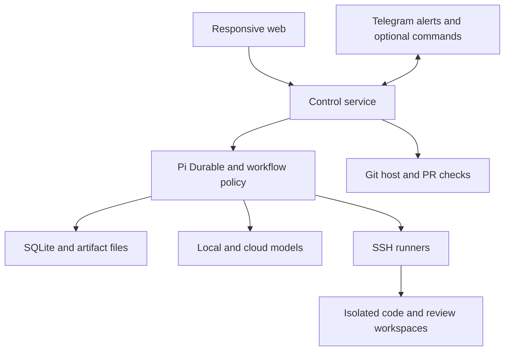
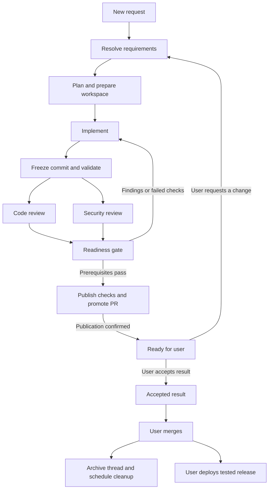
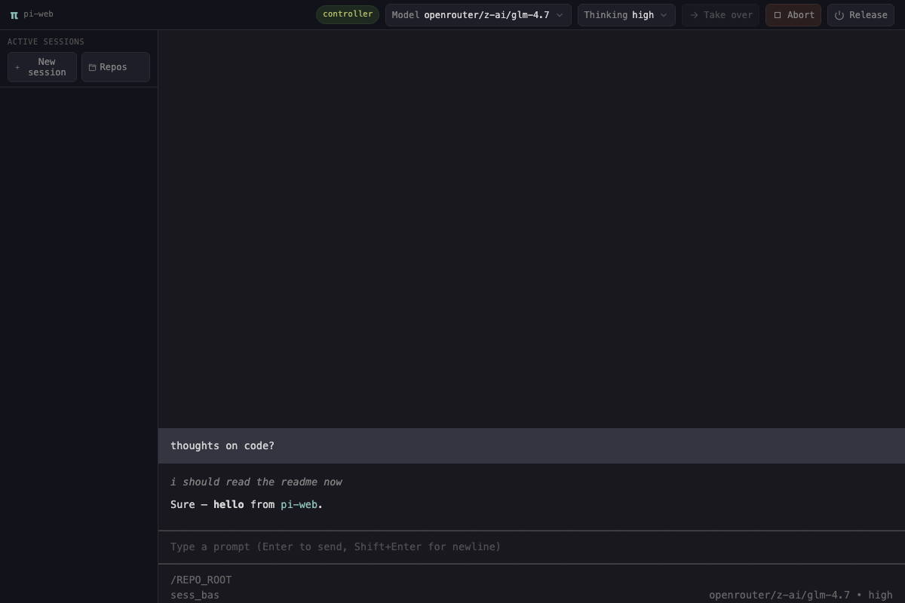
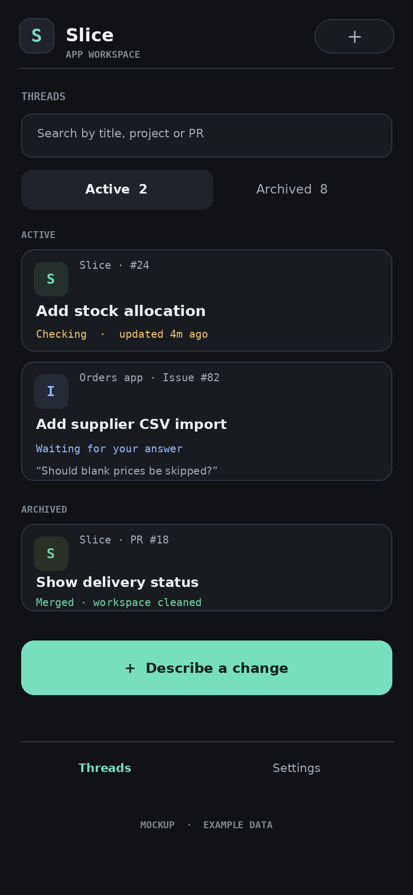
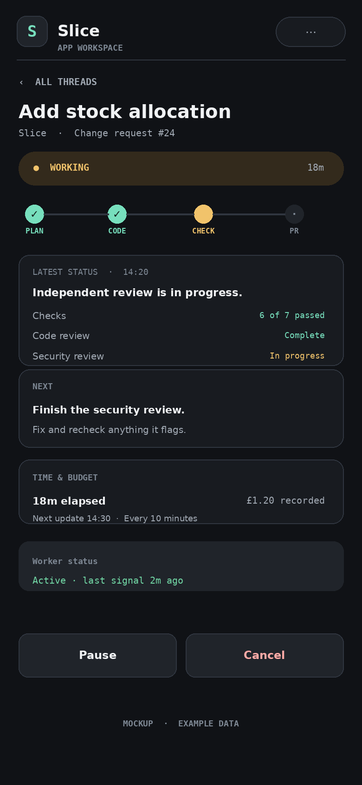
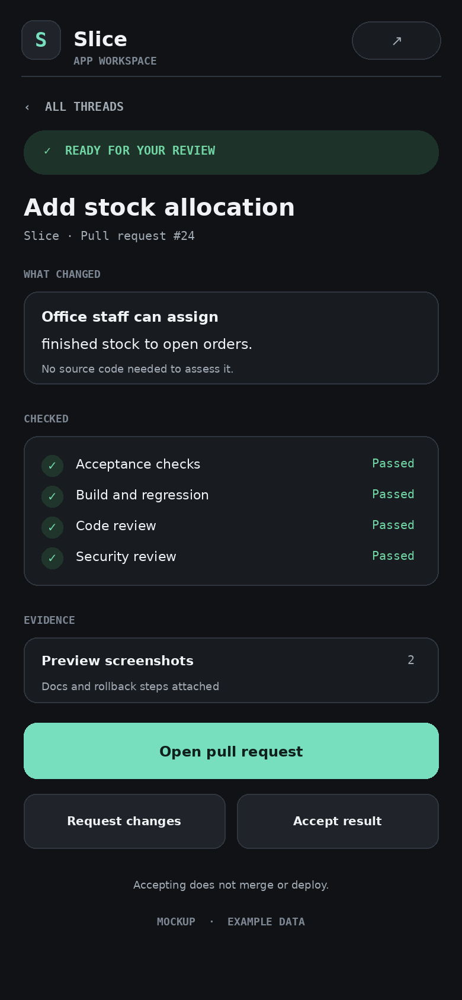
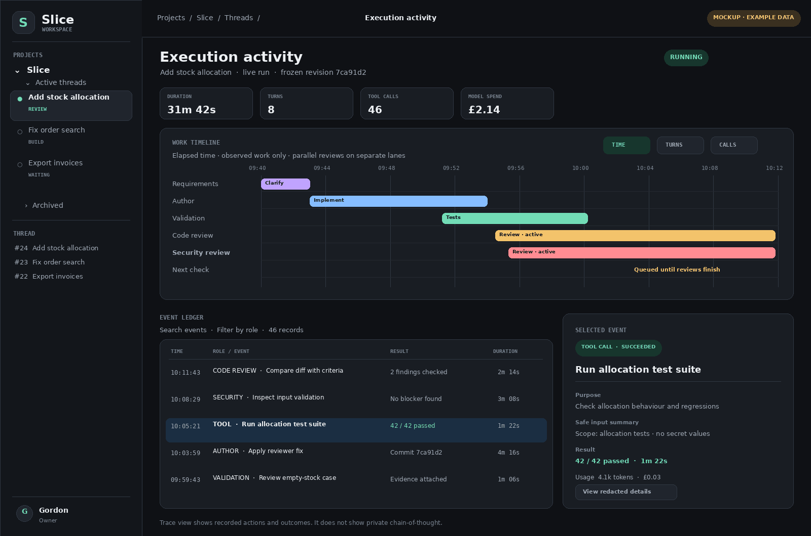

# Pi Durable agent build specification

Version 1.3 · 4 October 2026 · Responsive UI and thread steering design

The design review and corrections are recorded in [spec-review.md](spec-review.md).

## 1 Purpose and main decision

Build a small, self-hosted agent service that turns a change request into a checked pull request. The user controls the service from a responsive web app that works on phones, tablets, and desktop screens. Telegram sends alerts and can later provide a second control surface. Models can use local inference servers or approved cloud providers. Code stays on registered SSH hosts.

The service must complete requirements, planning, isolated implementation, tests, independent code review, independent security review, and evidence preparation. The user receives the completed result to check. The user then merges and deploys through the existing repository and release controls. The user should not need to read source code for routine changes.

Use Pi Durable for agent conversations and durable tasks. Use application code for workflow decisions, permissions, review gates, endpoint management, and the user interface. Model agreement is evidence. It is not the release rule. A deterministic gate must decide whether the PR is ready.

The design aims to spend about 80% of model use on verification and about 20% on requirements, planning, implementation, and repairs. This is a budget preference, not proof of quality. Do not generate extra reviews to reach a percentage.

### Initial assumptions

- One owner, Gordon, with several repositories and SSH hosts.
- One always-on Linux control host, separate from inference if convenient.
- GitHub is the first PR provider. Use an adapter so another Git host can be added.
- SSH endpoints can run Linux or Windows. Each repository declares its required build environment.
- Vue 3 is the proposed responsive web frontend. A small TypeScript backend hosts the API and Pi Durable adapter.
- Existing production credentials and release tools remain outside the worker environment.
- Routine work can start after the agent resolves requirements. An explicit user confirmation is needed only for material uncertainty or a scope change with material cost or risk.

## 2 Verified upstream boundary

The upstream sources were checked on 4 October 2026. Pin package versions and the lockfile when implementation starts.

Pi Durable is experimental. It provides durable tasks and conversations, typed persisted documents, compaction, and a custom execution environment interface. One process owns a storage backend at a time. SQLite is a supported backend. [S1]

Tools record intent before execution. Interrupted tools can replay if declared safe. Other interrupted calls require recovery handling. Submission deduplication does not make an external action execute exactly once. Child agent conversations and application workflow rules must be built by the application. [S1]

Pi AI provides model and provider abstractions, including OpenAI, other cloud providers, and custom OpenAI-compatible endpoints. Compatibility settings still matter. An endpoint that accepts a request can still fail tool or context requirements. [S2]

Everything below is a proposed design. API routes, tools, schemas, roles, and state names in this document are application interfaces. They are not claimed Pi Durable APIs.

## 3 Keep the system small

Start with one control service and one database. Do not add a message broker, a separate scheduler service, a vector database, or a plugin marketplace to version 1.

| Component | Responsibility |
|---|---|
| Responsive web app | Requests, questions, status, evidence, user acceptance |
| TypeScript control service | Authentication, API, workflow policy, notifications, adapters |
| Pi Durable | Agent conversations, task execution, checkpoints, compaction |
| Durable documents | Requests, revisions, findings, approvals, operation records |
| Artifact directory | Logs, screenshots, reports, release and rollback records |
| SSH runner | Job directories, isolated commands, Git operations, process status |
| Model adapters | Local inference and approved cloud providers |
| Git host adapter | Draft PRs, commits, checks, final PR status |
| Existing release system | User-authorised deployment and rollback |



One service instance owns the Pi Durable store. Use a process lock and fail closed if a second owner starts. Do not start multiple service replicas on the same SQLite file. The web app uses the service API. It does not open the harness database.

Use durable documents as the source of workflow truth. If an API index is needed, derive it from committed state. Do not create two competing sources of status. Artifact files are written atomically, hashed, and referenced by a durable document. A reconciliation task detects missing or unreferenced artifacts after a crash.

## 4 User flow

### Step 1 Submit a change

The user selects one of several registered apps and enters a request such as: “Add a goods-ready screen. Let the office allocate finished items to orders.” They can attach screenshots or example data. The same flow can start from a GitHub issue: choose an issue in a registered repository, review its title, body, labels, and comments, then select “Create task”. The issue provides context for requirements discovery; it does not bypass clarification, policy, budgets, or review gates.

The service records the issue's stable repository identity, issue number and ID, URL, and source revision or update time. It creates one linked job for each explicit issue-to-task request. If a job already exists for that issue, show it and offer a new linked job instead of silently starting duplicate work. The resulting PR links back to the issue. Use a closing keyword only when the project owner configures issue closure on PR merge. Version 1 reads issue data but does not post comments or change labels.

Issue text and comments are untrusted input. A GitHub issue webhook can notify the service or update its issue list, but it must not start work by default. Optional automatic issue-to-task rules can be added per project later; they must restrict eligible actors or labels, apply job budgets and concurrency limits, and use the same requirements and review gates as a task started in the app. Do not let issue text change service permissions or instruct an agent to reveal secrets.

A thread picker lists active and archived requests across all registered apps. Each row shows the project, request title, source issue or PR where applicable, stage, last update, and PR state. Search and filters help the user find an older thread.

The service resolves the registered repository and reads its current code, project rules, and build profile. It does not ask the user for facts it can safely obtain from the repository.

### Step 2 Resolve requirements

The requirements agent asks short questions where the answer changes behaviour. It can show proposed behaviour, examples, and a small mockup. It records:

- The problem and the users affected.
- Expected behaviour and acceptance criteria with stable IDs.
- Error cases, permissions, data effects, and compatibility needs.
- Explicit exclusions and reasonable assumptions.
- The likely test and rollback approach.

The web app shows the proposed result in plain language. For a clear routine request, it continues automatically and shows “Work started”. For material uncertainty, it shows a small set of choices and waits. A repository policy can require “Confirm requirements” for every request if the owner prefers.

### Step 3 Prepare the job

Create a job ID, capture the target branch commit, and create an isolated job repository plus a coding worktree and feature branch. Create a draft PR after the first useful commit. Keep the PR draft while work is incomplete. The user receives a completion alert only when the full readiness gate passes.

### Step 4 Implement and check

The author writes code and relevant tests. The validation agent independently maps each acceptance criterion to evidence. The code and security reviewers inspect the same frozen commit in separate conversations. Reviews can run in parallel if model capacity permits.

Findings return to the author. The author fixes them or gives a supported response. The relevant reviewer resolves each finding. Every new commit requires current reviews and relevant tests. Repeat within the job budget.

### Step 5 Present the completed result

The user receives a responsive result page with:

- What changed, written for an app user.
- A safe preview where one can be created.
- Before and after screenshots for visible changes.
- Acceptance criteria with results and evidence links.
- Code and security review summaries.
- Known limits and any accepted risks.
- Documentation and operator instructions where needed.
- Deployment steps and a tested rollback plan.
- The final PR link and the exact checked revision.

The main actions are “Request a change”, “Accept result”, and “Open PR to merge”. Acceptance records product approval. It does not merge or deploy. Merge and deployment remain distinct user actions.

### Step 6 Merge and deploy

The Git host enforces the required checks. The release system obtains the actual merged revision from the Git host, tests it, and creates a versioned release artifact independently of the job checkout. The user authorises deployment through the existing release system. The agent service can track the release and show the rollback action or instructions. Thread archiving and pending workspace cleanup do not block deployment or rollback.

Version 1 does not hold production deployment credentials. A later release integration may offer “Deploy” and “Roll back” in the web app. Those actions must use a separate executor and fresh user authorisation tied to the exact release and environment.

## 5 Agent roles and permissions

Roles are conversation profiles. They do not require permanent operating-system processes. Start them when work needs them.

| Role | Work | Access | Must not do |
|---|---|---|---|
| Requirements and planning | Clarify behaviour, create criteria, inspect app structure | Read source and approved project context | Approve its own implementation |
| Author | Implement, add tests, repair findings | Write coding worktree; isolated build commands | Merge, deploy, dismiss reviewer findings |
| Validation | Test criteria, negative cases, UI and integration behaviour | Frozen source; disposable test workspace | Modify the PR branch or report unrun tests as passed |
| Code reviewer | Check correctness, regressions, maintainability, concurrency and data behaviour | Frozen source and full relevant context | Write source or accept the author's claims without inspection |
| Security reviewer | Check trust boundaries, access control, inputs, dependencies and secrets | Frozen source; disposable security test workspace | Access production or silently waive findings |
| Escalation reviewer | Resolve supported disagreements and difficult findings | Same frozen evidence; stronger model profile | Change the workflow policy or force a pass |
| Evidence preparation | Summarise changes and prepare final packet | Read verified artifacts | Invent screenshots, test results or guarantees |

The deterministic coordinator is normal application code. It selects eligible work, starts conversations, checks outputs, and advances state. Do not give a supervisor model the power to remove required reviews or bypass failures.

### Independent review rules

1. Reviewers start in fresh conversations. Do not fork the author's reasoning transcript.
2. Give reviewers the requirements, relevant code, diff, baseline behaviour, and test records.
3. Keep the first code review and security review independent. Exchange findings after both first reviews finish.
4. Reviewers can inspect full relevant files, callers, data models, configuration, and dependency changes. A diff alone is insufficient.
5. Use distinct model profiles for author, code reviewer, and security reviewer. Prefer a different model family for at least one reviewer.
6. Two quantisations of the same weights do not satisfy a different-model requirement. The same model with another prompt also does not satisfy it.
7. If a required distinct reviewer is unavailable, wait or use an approved distinct fallback. Show a blocked state if none is available.
8. Do not promise independence of training data or absence of common errors. Model diversity reduces one source of correlated failure.

The owner configures available models. Example profiles are `author`, `code-review`, `security-review`, `validation`, and `escalation`. Store actual model identity, family, endpoint, prompt version, settings, and request IDs in every review record. Do not hard-code a model name into the workflow.

## 6 Review and repair rules

Every review must produce a validated structured report. Reject missing fields, unknown verdicts, and evidence references that cannot be resolved to the reviewed source or recorded checks. Limit formatting repair to two attempts. Invalid output is a failed review task, not a pass. The coordinator verifies format, provenance, and check results; reviewers and independent validation assess what the evidence means. This gate does not prove that code has no defects.

Each report contains the job and requirements revision, repository identity, base and head commit IDs, test-environment identity, model identity, review scope, verdict, findings, and evidence references.

Each finding contains:

- Stable ID and category.
- Severity: critical, high, medium, low, or informational.
- File and location, or a behaviour and reproduction path.
- The claim, likely impact, and supporting evidence.
- Proposed correction and a verification method.
- Status and the person or reviewer that resolved it.

Allowed verdicts are `pass`, `changes_required`, and `unable_to_review`. Missing context or missing tools must produce `unable_to_review` where they prevent a sound review.

Critical, high, and medium findings block readiness and cannot be waived. Fix low findings where practical. A low finding can remain only when a reviewer returns `pass` and a preconfigured severity policy permits it with a stated reason in the final packet. The agent must not lower severity to clear the gate.

The author cannot close a reviewer finding. The originating reviewer can mark it `verified_fixed` or `not_applicable` with evidence. A separate escalation reviewer can propose a resolution. Disputed blocking findings stay blocked. Owner exceptions are disabled by default. If enabled for a project, an exception can cover only a named low or informational finding with a `pass` review, or a pre-existing check failure with the same recorded signature at baseline. Bind it to the verification key and state the accepted risk. Record `owner_accepted` separately; it does not alter the original review verdict or test result. Label the result “Ready with accepted exception”. Required reviews, unresolved critical/high/medium findings, unknown model identity, invalid evidence, stale revisions, source-integrity failure, and isolation or credential failures cannot be waived.

Start with at most four review and repair rounds. Escalate earlier when the same issue repeats, reviewers disagree on a blocking issue, or a security-sensitive change needs stronger inspection. At the round or budget limit, stop in `blocked` and provide a short explanation with completed evidence. Never convert a time limit into approval.

### The readiness gate

A candidate is eligible for publication when the following prerequisites hold. It can still be a draft PR with pending Slice status checks at this point:

1. Requirements have a valid revision and no unresolved material question.
2. The branch exists, is committed, and has no uncommitted changes relevant to delivery.
3. Baseline failures are recorded. Required changed-behaviour tests pass. A pre-existing check failure can proceed only through the enabled, verification-key-bound exception policy; confirm the same failure signature existed at baseline.
4. Every acceptance criterion has independent evidence. A screenshot alone does not prove access control or data integrity.
5. Code review is complete on the final head commit and current review context, and passes on the normal path.
6. Security review is complete on that same commit and context, and passes on the normal path.
7. Required validation, secret scanning, dependency checks, and applicable static checks are complete.
8. No unresolved critical, high, or medium finding remains. A low or informational finding follows the preconfigured rule above. A pre-existing test failure can remain only through an exception that matches its recorded baseline signature. Every non-waivable prerequisite still holds.
9. Documentation, preview evidence where applicable, and rollback records are complete.
10. The remote PR head and the recorded head match.
11. The base commit still matches the reviewed merge context. An explicit merge candidate built from that base and head passes the required build and test checks from the project profile. These checks are separate from the Slice checks that this gate is about to publish.
12. The linked PR is open and still targets the configured repository and base branch.

Record the candidate verdict as `pass`, `pass_with_owner_exception`, or `blocked`. For an eligible candidate, enter `publishing`: publish the Slice checks for the recorded head and merge context, and promote the PR from draft through idempotent external operations. Re-read the PR and check results after those operations. Mark the job `ready` and send the completion notification only when the head and base still match, every required check has been acknowledged, and the PR is no longer draft. A publication outage leaves the job in `publishing`; it does not force another authoring cycle or falsely report completion.

New work on an already-ready PR first requires acknowledged removal of readiness: set the existing gate checks pending and return the PR to draft. If the PR has already merged, create a new linked job. Do not push repairs into a branch whose PR was merged.

The gate evaluation is recorded with its input hashes and policy version. A blocked or unsupported scan is not a successful scan.

### Invalidation

Bind each approval and evidence record to a verification key: repository, base commit, head commit, merge-candidate commit where applicable, requirements revision, policy version, tool configuration, and environment image or build profile.

A head change always invalidates both reviewer approvals and prior readiness. A requirements change, relevant base change, toolchain change, source-input change, resolved model change, or policy change also invalidates affected evidence. Reuse content as background information, but issue fresh approvals for the new key.

A rebase can keep the same textual patch and still change its behaviour. Revalidate it. If the target branch moves after the user accepts the result, show the acceptance as stale until the merge policy and required checks are satisfied again. Test the actual merged commit before production deployment, including after squash or rebase merge.

## 7 Model access and budget

Register cloud providers through Pi AI. Register local servers through a custom provider adapter with explicit compatibility settings. Connect to the private inference address from the control host. Do not put provider credentials into the web app, workers, repository, or model-visible shell environment.

Support separate URLs and capacities for llama.cpp, NInfer, Strata, llama-swap, and future servers, subject to capability checks. These names identify possible endpoints, not a promise that each server implements every required protocol feature.

Each configured profile declares the provider, model ID, stable model family or weight identity, context limit, output limit, tool support, image support, reasoning options, pricing metadata, privacy policy, concurrency limit, and permitted fallback profiles. Record the resolved model returned by the provider and the endpoint configuration revision for each attempt. Local model aliases and proxy URLs can change weights without changing their display names. Distinct profile names do not prove distinct models. Use pinned model versions or owner-maintained identity metadata where available, and record any identity limits. A detected identity change invalidates the affected attempt.

Track every model that authored the current change, including repair and fallback attempts. Required code and security reviewer identities must be distinct from each other and from those author identities. Recheck that constraint when choosing a fallback.

Run a capability check before a profile can serve an agent role. Check tool argument validation, streaming, cancellation, error responses, long-context limits, and structured report output. Check image input only for roles that need it. A code reviewer need not have vision if a separate validation role handles images.

Never send a local-only repository to a cloud fallback. Cloud permissions are set per repository. Fail closed if a profile's data policy is unknown. A cloud switch is recorded as a new task attempt with the same frozen input evidence.

### Starting allocation

| Activity | Planned share of model tokens |
|---|---:|
| Requirements and planning | 5% |
| Implementation and fixes | 15% |
| Independent validation and regression investigation | 25% |
| Code review and resolution | 30% |
| Security review and resolution | 20% |
| Final evidence checks and documentation | 5% |

These are planning shares. Repairs count as implementation. The author cannot label its own testing as independent review.

Track input, output, cached input, and reasoning tokens where the provider exposes them. Do not double-count reasoning tokens included in output. Show provider-reported and estimated usage separately. Track spend, elapsed time, and tool use as separate measures. Equal token counts do not imply equal cost or equal review quality.

Each project must provide default per-job money, token, round, active-time, and concurrency limits before paid work can start. A job can override them within owner policy. Report active work time and total elapsed time separately. Reserve verification capacity before authoring starts and warn at 70% of the configured money budget.

The model gateway reserves a conservative maximum cost and token allowance before every request, including compaction, formatting repair, retries, and escalation. Concurrent reservations draw from one job budget. Use the measured input, configured output and reasoning limits, and versioned price data; do not assume a cache discount in the reservation. Settle reservations from reported usage. Unknown usage remains uncertain and charged against a conservative allowance, never zero. Block paid requests whose cost cannot be bounded under policy. The budget limits admission of requests; provider billing is not an atomic part of the local database, so in-flight reservations remain accountable after cancellation or restart. Reaching a limit pauses further work until the owner raises it.

Use focused context and evidence links. Avoid replaying every author message to every reviewer. The two 5060 Ti cards need an endpoint capacity queue: several review conversations can exist at once while model requests run one at a time. Do not assume an always-on conversation needs an always-running inference request.

## 8 SSH hosts and Git workspaces

Register hosts and repositories before accepting work. A model chooses a registered ID. It cannot supply an arbitrary host, user, repository URL, or workspace root.

| Host field | Meaning |
|---|---|
| ID and address | Stable endpoint name and network address |
| OS and shell | Linux or Windows, command and path semantics |
| Host key | Pinned SSH identity; fail on a changed key |
| Credential reference | Owner-managed key outside model access |
| Runner root | Dedicated job area, separate from normal working directories |
| Capabilities | Toolchain versions, sandbox type, browser support, capacity |
| Limits | CPU, memory, disk, process count, output size, runtime |

Register more than one repository as a separate project profile. Each profile declares its stable project ID, Git provider and URL, default branch, allowed SSH endpoints, build commands, required checks, test fixtures, browser scenarios, preview requirements, branch-writer credential, PR and check publishers, allowed cloud profiles, release tracker, and rollback policy. Settings are owner-controlled and versioned outside the untrusted feature branch. Jobs record the profile revision used for each stage. The user chooses a project for each task; a worker receives only that project's repository, endpoint, and permitted credentials. Keep workspaces, policies, PR records, and evidence tied to the project ID.

Check current permission and privacy policy before admitting each new operation. Revoking cloud permission stops new cloud requests, including queued fallbacks; settle or cancel requests already admitted. Changing a build or gate profile invalidates affected evidence. Pausing or removing a project stops new jobs and pauses its active work at a safe boundary. Retain a tombstone and historical profile revisions for its threads, PRs, and release records.

The Linux control host must be able to use a Windows runner. For example, legacy ASP.NET WebForms and .NET Framework 4.8 builds need a compatible Windows toolchain. A successful Linux-only check cannot stand in for that build. The repository profile chooses the correct runner before work starts.

### Runner protocol

Use SSH to invoke a small installed runner. Send typed JSON input on stdin. Receive structured status and artifact references. Avoid constructing shell text from model-provided strings.

The runner exposes operations such as `prepare_job`, `run_check`, `get_process_status`, `cancel_process`, `create_snapshot`, and `collect_artifacts`. It records operation IDs, process groups, start time, exit code, and output files. Keep its protected journal outside disposable job directories. Builds and tests can continue while the control service restarts.

Use dedicated runner accounts, pinned host keys, and no SSH agent forwarding. The trusted runner and sandboxed job commands use separate OS identities. Job commands cannot access the runner's SSH credentials, operation journal, control socket, or other jobs. A reviewer cannot use the author's write lease. SSH provides transport; it does not provide the execution sandbox.

Every operation carries the job ID, role, operation ID, and a monotonically increasing lease generation. The runner checks them at admission. Revoking a generation prevents new coding and check operations; it does not prove an existing process stopped. Trusted status, cancellation, artifact export, and cleanup operations use separate permissions bound to the current job record. They remain available after author leases are revoked. After a restart or lease timeout, reconcile existing work before granting a replacement lease.

Start remote commands under a supervisor with a deterministic operation name, such as a container or service unit ID. The runner must find that operation even after a crash between process start and PID recording. A missing PID alone is not permission to start a duplicate. Reconcile any operation admitted before revocation.

### Worktree layout

Create a disposable Git repository per job. A service-owned cache may speed fetching, but the author cannot write the shared cache or another job's Git directory. Git worktrees share repository metadata, so they are a workspace tool, not a security boundary. [S3]

Example Linux runner paths:

```text
/srv/slice/jobs/<job-id>/repo/
/srv/slice/jobs/<job-id>/author/
/srv/slice/jobs/<job-id>/snapshots/<head-sha>/
/srv/slice/jobs/<job-id>/tests/<check-id>/
/srv/slice/jobs/<job-id>/export/
```

The service creates `slice/<job-id>/<short-title>` and a coding worktree from the recorded base commit. One author lease owns the branch. Record a source manifest covering the Git tree, submodule revisions, LFS objects, and other approved build inputs. Missing inputs block checks that depend on them.

Resolve submodules, LFS, and build dependencies only from project-approved hosts. Never forward repository credentials to URLs supplied by repository content.

Reviewers and previews use frozen source. Mount it read-only and keep outputs, fixtures, and independently supplied tests separate. For a toolchain that needs a writable source copy, record its initial and final source digests and reject undeclared source changes. Explicit generated inputs belong in the build profile and manifest. A check cannot cite the original commit if it actually ran against altered code.

Only service-controlled Git operations can commit and push the feature branch. The trusted runner owns the authoritative Git metadata. The author can write permitted source and scratch files but has only read access to that metadata for inspection. It cannot write the common Git directory, change remotes or hooks, or access publishing credentials. A private sandbox Git repository has no publishing authority. The service validates and imports the source changes before making an authoritative commit.

Before each commit or push, validate the lease generation, branch, allowed paths, expected parent, remote head, and PR state. Never use a user's live checkout, remove their files, or reset their work.

Track filesystem changes as well as commits. After an uncertain edit, inspect the workspace before deciding to retry. Preserve failed work for inspection. A confirmed merge archives the thread immediately and schedules asynchronous workspace cleanup. Copy required artifacts to persistent control-service storage and verify their digests before readiness and before deletion; the runner's export directory is temporary.

Never delete durable conversations, review history, merge records, or retained evidence as part of workspace cleanup. Delete only after job processes stop and leases are revoked. Do not use force removal as the normal cleanup path. For other closed jobs, use a configurable cleanup period, initially 30 days after close.

Allow work in several registered repositories at once, subject to endpoint and model capacity limits. Start with one active author per repository to avoid branch and resource collisions. Queue a second task for the same repository or let the user start it after the first author releases its lease. Different repositories can proceed concurrently with separate clones, policies, and credentials.

## 9 Tool access and isolation

Keep the model-facing tool set small. The familiar coding tools can remain `read`, `write`, `edit`, and `bash` inside an isolated author workspace. Add a small number of workflow tools. Reviewers receive read tools and a constrained disposable test command tool.

| Application tool | Caller | Enforcement |
|---|---|---|
| `ask_user` | Requirements role | Typed question; idempotent pending question record |
| `read_project` | All technical roles | Registered repo and frozen or author workspace |
| `read`, `write`, `edit`, `bash` | Author | Path, OS permissions, sandbox and resource limits |
| `run_check` | Author and validation | Approved check profile; isolated execution |
| `request_review` | Coordinator | Frozen revision and eligible reviewer profile |
| `submit_finding` | Reviewers | Schema validation and evidence link |
| `submit_resolution` | Reviewer or escalation role | Own finding or explicit escalation authority |
| `capture_preview` | Validation | Isolated preview, synthetic fixtures, approved route |
| `publish_pr` | Coordinator only | Known branch and operation record |

Workflow tools are not exposed where a role does not need them. A model-provided path, comment, command, or JSON field cannot grant permission.

Repository files, issue text, dependency scripts, logs, screenshots, and external web pages are untrusted input. They cannot change permissions, cloud policy, readiness rules, or deployment approval. Owner-approved project instructions can guide coding, but cannot override service policy.

Builds and tests execute untrusted code. Run them in disposable containers or VMs with no production access. On Windows, use an isolated build VM or an equivalent enforced environment. Separate a network-enabled dependency fetch step from checks where practical. Restrict outbound access, fixture credentials, and mounts. Keep service and provider secrets out of both steps.

Disable automatic Git hooks unless the owner explicitly enables a trusted hook profile. Treat CI workflow, scanner configuration, authentication, migration, release, and rollback changes as sensitive. The author cannot change the external gate definition. A PR that changes its own tests must still pass independent tests derived from requirements.

Do not rely on a prompt or a shell-command denylist as the isolation boundary. Raw `bash` is acceptable only where OS or VM controls bound its effects. Reviewer execution is never treated as read-only merely because its stated purpose is review.

## 10 Durable workflow and recovery

The main workflow is:



Use durable task IDs for workflow stages. The control service reads committed state before selecting the next stage. A restart must not create a second author or lose a pending user question.

Use separate state fields so archiving, cleanup, and release tracking cannot overwrite one another:

| Field | Values or purpose |
|---|---|
| Stage | Requirements, planning, implementation, checks, publication, ready, finished |
| Run state | Running, waiting for user or capacity, pause requested, paused, blocked, cancel requested, cancelled, failed, completed |
| Archive state | Active or archived, with reason and verified merge time |
| Cleanup state | Workspace available, cleanup pending, cleanup failed, cleaned |
| Release state | Not started, waiting for approval, deploying, deployed, failed, rolled back |

Bind task results and transitions to a workflow generation and verification key. Late results from a superseded generation can remain in the audit record but cannot advance the current job. An archived job is searchable and read-only. Follow-up work creates a linked new job with a new branch and workspace.

### External operation records

Every external mutation has an operation ID and record with `planned`, `running`, `succeeded`, `failed`, or `uncertain` status. Include expected preconditions, observed result, external IDs, and reconciliation method.

| Operation | Recovery rule |
|---|---|
| Read file or Git status | Replay if safe and preserve evidence revision |
| Create job directory or worktree | Check job marker, branch and base; reuse only if they match |
| Edit source | Inspect current file and expected content; do not replay an arbitrary shell edit |
| Start a build or test | Find the supervised operation even if no PID was recorded; reattach or reconcile before any replacement run |
| Commit or push | Inspect commit ID and remote branch; reconcile before retry |
| Create a PR | Find the recorded head branch and existing PR before another create |
| Publish checks | Use exact commit and gate ID; reconcile existing result |
| Send Telegram alert | Outbox with deduplication; allow for an occasional duplicate after uncertainty |
| Observe PR merge | Verify the PR's merged state and merge commit from the Git host; treat webhook or poll events as hints until verified |
| Delete merged workspace | Confirm executable job tasks and remote processes stopped, leases revoked, and required artifacts exported; verify manifest and path boundary; delete only that job's resources |
| Deploy or roll back | Separate release executor; inspect actual release state; no blind replay |

The local database and a remote Git host cannot commit atomically. Persist intent, act, then persist the result. After a crash, reconcile. Pi Durable's replay setting is not a replacement for this external operation journal.

Treat request retries as the same submission when they carry the same request ID and payload hash. Reject reuse of an ID with a different payload. Remote operations also use job and operation IDs. Exactly-once external execution is not assumed.

### Pause and cancel

Pause enters `pause_requested`, stops admission of new model and tool calls, and lets in-flight work reach a safe checkpoint. Show “Finishing the current step” until the job is actually paused.

Cancellation explicitly targets foreground and background job tasks, model requests, previews, and remote process groups. Pi Durable conversation abort can leave owned background tasks running, so the adapter must request their cancellation too. [S1] Reporting timers and release tracking are separate tasks with their own lifecycle policy.

The runner confirms termination. If a host cannot be reached, show “Cancellation pending on host”, revoke admission, and retain the outstanding operation records. Do not grant a replacement lease or claim that work stopped until remote state is known. Preserve the branch and PR; do not automatically delete them.

A browser or Telegram disconnect never cancels work. Reconnect obtains a state snapshot, then resumes the event stream from a cursor. Cancellation and confirmation operate on the same durable job regardless of the surface used.

### Steer a thread

Steering is a separate, durable command, not an ordinary chat message. It includes a request ID, payload hash, and expected command revision. Reject a stale command revision and return the current state without applying the instruction.

For an active job, record the instruction first, then stop admission of new model and tool calls. Let already-admitted operations complete or reconcile them at a safe boundary. The coordinator assesses how the instruction affects requirements, code, and evidence before work resumes. A message that only clarifies existing intent can update the conversation and continue. A change to acceptance behaviour creates a new requirements revision. Ask for confirmation before a material scope, cost, or risk change when project policy requires it.

If a new requirement affects the implementation, preserve the current worktree and branch for assessment, but mark dependent checks and reviews stale. Do not present the prior result as ready. If a PR is ready or in `publishing`, reconcile the Git host and withdraw readiness before starting new author work; keep it draft until the new revision passes the full gate. If the PR is already merged, reject steering on the archived job and offer a linked follow-up job. Steering a paused job records the instruction without resuming it.

### Threads, archiving, and worktree cleanup

In the UI, “thread” means the user-facing history for one change request and its durable conversations. The picker has Active and Archived views. Archived rows remain searchable by project, title, PR number, branch, and date. Opening one shows its transcript, status reports, final summary, review findings, checks, acceptance record, merge commit, and retained evidence. It does not reconnect the user to a running agent.

Detect merges through a verified Git-host webhook where available, with a periodic reconciliation poll as a recovery path. Deduplicate webhook deliveries. Do not archive or delete a workspace from a branch name, a closed PR event, or an unverified notification. Confirm that the exact linked PR has `merged: true` and record its actual merged revision. A non-null GitHub `merge_commit_sha` on an unmerged PR can identify a test merge; it is not merge confirmation. [S7]

After merge confirmation, record the actual merged revision, archive the thread, revoke its workflow generation, and stop its periodic reports. Persisted conversations are history, not running processes. Cleanup runs separately: stop or settle active job tasks and runner processes, stop previews, release mounts, and verify retained artifacts before deletion. An offline host leaves cleanup pending without delaying archive visibility or release tracking.

Remove the complete job workspace: its worktree, disposable repository, snapshots, test copies, dependency directories, build outputs, preview containers, and job-owned volumes. Release ports and other job resources. Retain exported evidence, release artifacts, and bounded shared caches outside that workspace. Keep the remote merged branch and Git history under the Git host's normal retention policy. Do not delete another job's files.

Cleanup runs through an idempotent runner operation. It checks the job ID, a service-owned manifest, path containment under the configured job root, process state, and lease. It refuses paths that resolve outside the root or no longer match the manifest. It records `cleanup_pending`, `cleaned`, or `cleanup_failed`. A failure leaves the archived thread and records intact, keeps the error visible in the picker, and allows a safe retry. Never report disk cleanup as complete until the runner confirms deletion.

The archived transcript and result summary remain in durable storage. Keep the final evidence packet outside the worktree for a configurable retention period, initially 365 days. Show the user when an individual large artifact expires; preserve the review report, merge record, and evidence manifest for the thread's configured history period. Apply the same retention policy to backups.

If the user merges a PR while work is unexpectedly active, block new author and publishing operations, then cancel or settle child work. Reconcile any operation admitted before revocation. Record the actual merged revision separately from any later feature-branch commit; never attribute late work to the merged release. If a process cannot be confirmed stopped, keep cleanup pending and alert the user.

## 11 Responsive web and Telegram

### Responsive web app

1. **Threads:** Active and Archived views, search, project and PR filters, stage badges, and last update.
2. **New request:** app selector, text, attachments, optional budget.
3. **Request detail:** conversation, requirement revisions, current stage, questions, spend, pause, cancel, and steering controls for any non-archived thread. Show a status report every 10 minutes by default. Let the user change the interval or turn reports off for that job.
4. **Result:** preview, screenshots, evidence, limits, rollback plan, PR link, acceptance and change request.
5. **Settings:** registered projects, hosts, models, privacy rules, budgets, default report interval, and alerts. The owner can add multiple repositories, assign allowed SSH endpoints and model profiles, test connectivity, and pause or remove a project. Pausing or removing it pauses active jobs and blocks new work while preserving threads, PR links, and evidence.

Keep one responsive interface and preserve the same thread and project structure at every size. On narrow screens, use pi-mobile's low-chrome layout as a reference: a compact header, a slide-out thread and project picker, focused work view, and controls near the user's thumb. On desktop, keep the project and thread rail visible, give the work area more width, and show optional status and evidence panels beside the conversation. Do not only enlarge the phone layout. Keep a clear path back to the thread list. The screenshot below is from the upstream repository's desktop replay test; its text is a fixture, not a proposed Slice transcript:



*The reference is pinned to commit `4cc9b712254d84c90a00373c972c8a417fd26fb9`. Reuse the compact layout and session navigation; Slice's own screens below show the task workflow.*

Use these Slice phone concept screens as layout references:



*Thread picker concept. Active work and archived results share one searchable list. A merged thread stays visible after workspace cleanup.*



*Work status concept. Show stage, checks, next step, last worker signal, elapsed time, budget use, and next report. Do not show private reasoning or an unfiltered action stream.*



*Result concept. Lead with user-facing behaviour and verified evidence. Keep requesting changes, accepting the result, and opening the PR as separate choices; acceptance does not merge or deploy.*

### Desktop concepts

The desktop view can expose more workflow detail without turning the user interface into an internal transcript. Keep the change summary and next action easy to see. Put technical activity in an optional tab or panel.


*Thread workspace concept. The user can steer an active thread from a persistent composer. Status and review progress stay visible beside the conversation.*



*Activity concept. Use a Gantt-style horizontal view for actual stage and tool durations, show overlapping reviews on separate lanes, and keep a selectable event ledger below it. Offer time, turn, and call views. Show start markers for in-flight work; do not invent end times or durations.*


*Result concept. Use the extra width for before-and-after previews, acceptance results, review summaries, limits, rollback information, and separate user actions.*

All Slice concept images use example data. They are product references, not captures of a running Slice app or proof that any check passed. Slice captures real screenshots only from a tested preview at the revision and environment recorded in its evidence manifest.

For activity details, show a durable event ledger with role, stage, timestamp, measured duration, tool name, safe input summary, outcome, usage, and evidence links. Let the user filter and inspect records. Redact secret values and unsafe or unrelated output. Never show private model reasoning or system prompts. Show concise user-facing progress and reviewer findings with their evidence; these are not chain-of-thought. Keep the event ledger usable without the chart and provide keyboard navigation.

The Gantt-style timeline is a view of recorded events, not a plan or a promise about completion time. Distinguish queued, running, completed, failed, cancelled, and uncertain operations. Keep a linear event list for screen readers and narrow screens. This design is inspired by the DeepSeek Harness Trajectory view's event ledger and timing overview; Slice uses its own workflow events and access rules. [S10]

Keep the result usable on an iPhone or iPad without horizontal scrolling. On desktop, use the extra width for project/thread navigation, a main work area, and optional detail panels. Put behaviour and preview evidence first. Put source diffs, redacted tool logs, user dialogue, and review reports behind optional detail controls. Never expose private model reasoning. Show “Not tested” and “Blocked” clearly; do not replace them with a green summary.

Support steering in every non-archived thread. The composer records an auditable user instruction against the current command revision. A steering instruction is not a privileged command and cannot bypass repository policy, review gates, budgets, or release approval. If work is active, stop admitting new model and tool calls until current operations reach a safe boundary and the coordinator assesses the instruction. Classify it as clarification, constraint, or scope change. Update the requirements revision when its meaning changes; ask a question or request confirmation when it adds material scope, cost, or risk. Keep existing work for assessment instead of deleting it automatically.

When steering changes requirements, invalidate affected tests, reviews, acceptance, and readiness evidence. If a PR is ready or publishing, first withdraw or reconcile readiness and return the PR to draft before new authoring work. If the PR has merged, keep the old thread archived and offer to create a linked follow-up job. A steering message on a paused job is recorded but does not resume it. Show the user the impact and current job state after each instruction.

The new-task flow has “Describe a change” and “Start from a GitHub issue” entry points. Issue selection searches only registered repositories and excludes pull requests. The issue view identifies its repository, number, title, state, labels, author, latest update, and relevant comments before the user starts a task.

Make the result usable on an iPhone or iPad without horizontal scrolling. Put behaviour and preview evidence first. Put source diffs, redacted tool logs, user dialogue, and review reports behind optional detail controls. Never expose private model reasoning. Show “Not tested” and “Blocked” clearly; do not replace them with a green summary.

Use a responsive web app with an optional home-screen install. Cache the app shell only. Sensitive job records and evidence require authentication. Browsers closing or sleeping must not affect worker execution.

Use the owner's existing identity provider where available, or a small single-owner authentication setup. Require TLS, secure cookies, CSRF protection for session-based writes, authentication on event streams and artifacts, and fresh authentication for later release actions. Do not place model or SSH keys in browser storage.

The API uses HTTP commands plus server-sent events for status. WebSockets are unnecessary unless later interactive requirements justify them. Design routes such as:

```text
POST /api/jobs
GET  /api/jobs
GET  /api/projects
POST /api/projects
GET  /api/projects/:projectId/issues
POST /api/jobs/from-issue
GET  /api/jobs/:id
GET  /api/jobs/:id/events
GET  /api/jobs/:id/status-reports
PATCH /api/jobs/:id/status-settings
POST /api/jobs/:id/messages
POST /api/jobs/:id/steer
POST /api/jobs/:id/requirements/answers
POST /api/jobs/:id/pause
POST /api/jobs/:id/resume
POST /api/jobs/:id/cancel
POST /api/jobs/:id/request-changes
POST /api/jobs/:id/accept-result
GET  /api/jobs/:id/evidence
GET  /api/jobs/:id/artifacts/:artifactId
```

Mutating routes require a request ID and payload hash. Creating a project or job does not require a revision of a resource that does not yet exist. Updates require the expected revision of the affected resource. Requirements answers also identify the pending question and its revision. Conflicts return the current state; late answers cannot change an archived or superseded request. Keep command revisions separate from telemetry so a status report does not invalidate an owner's form. Validate artifact IDs against the job; never turn a URL parameter into an unrestricted path.

### Periodic progress reports

Enable status reports by default for each new job, with a 10-minute interval. Let the owner change the default and let the user choose a different interval from 1 to 60 minutes or turn periodic reports off for that job. Show the most recent report on the job page and keep a time-stamped report history in the thread. Send the same short report through Telegram only when that channel is linked and the user has enabled periodic Telegram reports. Required questions, blocked work, failures that need action, and completion can trigger an immediate alert outside this interval.

Build the report from committed workflow events, runner state, completed checks, current model usage, and the durable cost record. Do not call an LLM to create a routine report. Do not stream or quote chain of thought, private conversation content, raw shell commands, raw action logs, secret values, or draft code. The report explains the current state in plain language and links to the authenticated thread for approved details.

Each report contains:

- Project and change title, current stage, time in that stage, last progress time, and age of the last observed worker heartbeat.
- What completed since the previous report and what is in progress now.
- What the next stage is, where the workflow has enough information to say.
- Any blocker, dependency, queued capacity, or answer needed from the user.
- Elapsed and active work time, provider-reported spend, estimated or uncertain usage, and the budget remaining after reservations.
- A remaining-time range and confidence label when there is enough history to estimate it.
- The time of the next scheduled report and a link to the thread.

If nothing changed, identify what the job is waiting for. Distinguish slow work with a current heartbeat from a worker whose status is unknown. Do not treat a heartbeat as proof of useful progress.

Estimate stage time and whole-job remaining time separately. Use comparable project, change, and workflow history only when it supports a calibrated range. Record the cohort, sample count, observed error or coverage, and confidence basis; a fixed number of completed jobs does not prove calibration. Account for queue time and further repair rounds. Without usable history, say “Remaining time unknown”. A configured build duration can support a labelled planning estimate for that stage, with low confidence. Do not turn it into a whole-job countdown or invent progress percentages.

Persist the interval, reporting generation, next due time, and report records. Create one report record per job, generation, and due time. After a restart or several missed ticks, coalesce overdue ticks into one current report, then schedule the next future tick. Do not send a backlog of stale updates.

Reports continue during paused, waiting, and blocked work. Reaching `ready`, confirmed cancellation, terminal failure, or archive stops periodic reports and records the final update. A new request for changes starts a new reporting generation. Changing the interval or disabling reports also invalidates queued periodic delivery for the old generation.

Before delivery, recheck enabled channels, reporting generation, terminal state, and message expiry. A failed delivery uses the outbox without duplicating the report record; uncertain Telegram delivery can still produce an occasional duplicate message. Notification failure does not stop work. Reject intervals outside the configured range. The web UI shows the report even when the device missed a push notification, and shows when its source status is stale.

### Telegram defaults

Version 1 sends only important alerts: a required answer, completed work, or a persistent failure needing attention. Each message links to the authenticated web page and includes the app, change title, stage, and job ID. Do not send every agent turn.

Periodic progress reports appear in the web thread every 10 minutes by default. Telegram can deliver the same brief report when the user enables that option. The user can change the interval or disable periodic reports for an individual job.

The user must first start the bot and link the chat to the authenticated account through a one-time code. Store the numeric user and chat IDs. Do not trust a display name or username as identity.

Optional version 2 commands are `/new`, `/status`, `/pause`, `/resume`, and `/cancel`, with inline requirement answers. They call the same authenticated workflow API and use durable request IDs. Telegram cannot bypass the web or workflow permissions. Exclude merge and deployment commands from the initial Telegram scope.

Use long polling to receive the bot start and account-link messages even when job commands are disabled; no inbound webhook is required. If commands are enabled, use either long polling or a verified webhook. Deduplicate update IDs, enforce the linked account, and validate the webhook secret header when webhooks are used. [S5]

## 12 Evidence and user acceptance

Validation must verify behaviour, not just that the code builds. Derive scenarios from the requirements before inspecting the author's tests. Check permissions, invalid input, repeat actions, concurrent actions, and data effects where relevant.

Use a browser test tool in an isolated preview to capture real UI evidence. Capture a baseline at the recorded base revision and an after image at the final revision, using equivalent fixture data and viewport. Store route, scenario, viewport, commit, capture time, and image hash. Redact sensitive data.

Screenshots must come from a running tested app. Do not generate images to stand in for proof. Where the change has no visible UI, provide API examples, test output, or an operational demonstration instead. Mark screenshots “Not applicable” with a reason.

A preview must use synthetic or sanitised data and have no route to production services. Preview routing and authentication are separate from the control UI. Serve stored HTML and other active artifacts from an isolated origin or as safe downloads, so evidence cannot execute scripts inside the authenticated control page.

Export verified evidence to persistent control-service storage, for example `/var/lib/slice/artifacts/<job-id>/`, and register its digests and artifact IDs before promoting the PR. Runner paths are not permanent evidence links. Release artifacts live in the existing release system's retained artifact store, outside disposable job directories.

The final packet includes:

- Requirements and behaviour summary.
- Acceptance matrix with criterion, scenario, result, and artifact reference.
- Test commands, environment, exit codes, and complete log links.
- Code review and security review reports for the final verification key.
- Screenshot or other demonstration evidence.
- Dependency, secret, and static check results where applicable.
- Changed user or operator documentation.
- Risks, limits, deployment record template, and rollback procedure.

The PR body is short and links to durable evidence. Include the concrete problem, resulting behaviour, validation, and material release risks. Avoid pasting full agent conversations. Artifacts must remain available after worktree cleanup.

After a merge, the thread picker must still open the final packet and merge record. The merge must not break artifact links before their retention date. Large logs and screenshots can expire under the configured policy; the UI then shows their expiry date or that they have expired.

User acceptance is bound to the same verification key as the result. If new code or requirements arrive, set acceptance stale. “Request a change” creates a new requirements revision and returns the job to the appropriate stage. Never treat a chat response such as “looks interesting” as acceptance, merge authorisation, or deployment authorisation.

## 13 Git host checks and credentials

Use separate author-publishing and gate-publishing identities. The author never receives a token that can post successful gate checks. The gate identity publishes results only from validated application records.

Required checks should include `slice/requirements`, `slice/validation`, `slice/code-review`, `slice/security-review`, and `slice/release-plan`. Configure them as required checks for the target branch and bind them to the expected GitHub App. Require the branch to be up to date before merge and dismiss stale human approvals under the repository's policy. A base update must not silently reuse checks for an earlier merge context. A later merge-queue integration must publish checks for the queue's merge-group revision too. [S4]

The candidate gate distinguishes prerequisite build checks from the Slice checks it publishes. Final readiness requires all configured check names, identities, and passing results on the exact applicable revision. An owner exception is visible in check details and the result page; it never rewrites the original test or reviewer result.

LLM reviewers do not need separate human GitHub accounts. Their reports are distinct application records. One trusted gate App can expose separate status checks. Do not count an AI status as a required human approval if the repository also requires a human review.

Separate the Git identities so no service credential can both write source and merge a PR:

1. A repository-scoped SSH deploy key lets the trusted Git service push source branches. Keep it on the control host. Do not forward it to workers or expose it to a model. Host branch controls must allow it to update only the registered feature-branch pattern and reject its direct push to the target branch. Verify this exact behavior in the disposable repository before enabling a project.
2. A GitHub App with `Pull requests: write` creates, promotes, and updates PRs. Give it no `Contents: write` permission. The PR merge endpoint requires `Contents: write`, so this identity cannot merge through that API. [S7]
3. A separate GitHub App publishes required checks. Give it only the check permission it needs and bind the required checks to this App. Do not give it source or PR write permissions. [S4]

No runner, author, control-surface request, or model can select other credentials. Restrict branch-creation and update rules to the registered feature-branch pattern where supported. Protect the target branch with required PRs, strict up-to-date checks, stale approval handling, and no bypass for service identities. Keep required checks separate from any direct-update rule; a human's permission to update a ref must not bypass PR checks. Confirm the exact ruleset and plan on each project before work is enabled. [S8]

In a disposable onboarding repository, satisfy every check and human approval first. Verify the branch key can push the intended feature branch but cannot directly update the target branch; the PR App can create and promote a draft PR but its merge request is denied for lack of `Contents: write`; the check App can publish only its bound checks; and the owner can merge through GitHub. Confirm service identities cannot change or delete the protection. A denied merge with failing checks proves nothing. Do not probe permissions on a production PR.

If a repository cannot enforce these permissions, show the missing control and block real PR publishing until an owner-approved configuration passes this test. The onboarding check must not infer protection from a successful push.

## 14 Deployment and rollback

The release system must retain the previous working artifact. A rollback normally redeploys that artifact. It does not rebuild an old branch with today's dependencies. A Git revert can create a later source correction, but it is not the immediate operational rollback.

For each release, record the merged commit, artifact digest, dependency lockfile digest, build environment, configuration version, migration IDs, previous release ID, health checks, deployment time, and operator approval. Preserve the same build artifact through staging and production. A source change after acceptance must not enter the release unnoticed.

The initial service prepares records and instructions for each project's existing release system. Version 1 does not build a general deployment engine. The release system must supply an enforceable user approval and health-check step. If these do not exist, implementing them is a prerequisite for production use.

### Normal deployment procedure

1. Test the actual merge result and build the versioned artifact.
2. Deploy that artifact to staging with representative test data.
3. Run smoke checks and rehearse the change's rollback.
4. Record the previous release and compatibility of its code with the new data state.
5. The user approves the specific artifact and production environment.
6. Deploy through the release executor and perform health checks.
7. Watch error rates and the changed behaviour for a configured observation period.

An automated return to the previous artifact can be allowed only as part of the user's deployment approval, with a known compatible data state and explicit health triggers. Otherwise, alert the user and stop further changes.

### Rollback levels

| Change type | Default recovery | Required evidence |
|---|---|---|
| UI or stateless code | Redeploy previous artifact | Previous artifact exists; staging rollback smoke checks pass |
| Configuration | Restore versioned configuration | Previous values available securely; compatibility check passes |
| Feature-flagged behaviour | Disable the flag, then restore code if needed | Flag effect tested; data effect understood |
| Additive database change | Restore previous code and keep compatible schema | Old code tested against new schema |
| Data transformation | Tested compensating operation or fix forward | Validation, affected-record record, and write handling plan |
| Destructive schema or external side effect | Specific recovery plan | Owner-reviewed limits; no generic easy-undo claim |

Use expand-and-contract migrations for database changes: add compatible structures, deploy code that can work with both states, migrate and check data, then remove old structures in a separate later change. Keep the rollback window open before that last step.

A database backup does not guarantee loss-free rollback. Restoring it can discard later writes and may not undo messages, third-party actions, or data exports. Record backup scope, recovery time and data-loss objectives, restore test results, and how new writes will be preserved or stopped. Do not make destructive production down-migrations the default rollback.

The final packet must state whether rollback is code-only, code-and-configuration, or requires data recovery. If simple rollback cannot be achieved, show that limit before the user accepts the result. Require a separate owner decision before a destructive or materially irreversible release.

## 15 Data records

Use versioned typed documents for application records. Add migrations before changing a stored schema. Keep historical records append-only where practical; create superseding records rather than rewriting past approvals.

| Record | Required content |
|---|---|
| Project | Stable ID, repo identity, allowed hosts, versioned build and test profiles, issue settings, privacy and gate policy, Git identity references, default budgets, active or tombstoned state |
| Job or thread | ID, owner, project and profile revision, request source and issue snapshot, stage, run/archive/cleanup/release states, command revision, workflow generation, timestamps, budgets, report settings and generation, next report time, linked predecessor |
| Steering event | Job, owner, request ID, payload hash, command revision, timestamp, impact classification, requirements revision, safe-boundary reconciliation, evidence invalidated |
| Issue link | Provider, repository ID, issue ID and number, URL, captured update time, linked job IDs |
| Requirements | Revision, criteria, assumptions, decisions, scope |
| Workspace | Host, repo, branch, base, paths, lease generation, head, supervised operation IDs, resource manifest, cleanup status and timestamp |
| Git identity | Project, branch-writer key, PR metadata App, check publisher App, granted permissions, credential references, verified ruleset revision |
| Source snapshot | Commit and tree, submodule and LFS identities, approved input digests, build profile, initial and final tested source digests |
| Stage run | Workflow generation, role, conversation and task IDs, resolved model and endpoint revision, prompt and policy versions, attempt usage, outcome |
| Budget reservation | Job, model request and attempt, maximum tokens and cost, price revision, admission and settlement state, reported or uncertain usage |
| Finding | Claim, severity, source review and original verdict, evidence, response, resolution history, owner exception and verification key if permitted |
| Review report | Verification key, reviewer identity, scope, verdict, findings |
| Check result | Verification key, source snapshot, command profile, environment, exit code, artifacts, original result and any separately recorded exception |
| Artifact | Job, type, digest, size, location, verification key, retention |
| External operation | Job and generation, operation ID, intent, preconditions, status, observed external or supervised ID, reconciliation result |
| Acceptance | Owner, timestamp, exact verification key, exceptions, stale status |
| PR record | Repository, number, URL, branch, base and head, draft and verified merge status, actual merged revision, gate candidate and publication result |
| Notification | Outbox ID, job event, reporting generation where applicable, channel, recipient reference, expiry, status |
| Status report | Job, generation and report IDs, due and creation times, stage snapshot, progress and heartbeat age, blockers, reported/reserved/uncertain spend, stage and whole-job ETA basis, content version, delivery state |
| Release record | Release artifact, actual merged commit, approval, previous release, recovery plan |

A finding can refer to an earlier commit, but its final resolution must identify evidence on the current one. Store test and screenshot metadata outside the conversation summary. Compaction must never erase requirements, unresolved findings, approval identity, budgets, or operation state.

Keep ordinary logs redacted. Keep secrets out of prompts and artifacts. Encrypt backups and limit access to source and transcripts. Provide export of a job's requirements, findings, checks, and artifact references so the service can be migrated away from Pi Durable later.

## 16 Source layout and adapters

Use a single repository with a small number of modules:

```text
Slice/
  apps/server/src/
    api/
    workflow/
    policy/
    adapters/pi-durable/
    adapters/models/
    adapters/git-host/
    adapters/ssh-runner/
    notifications/
    records/
  apps/web/src/
  runner/
  config/examples/
  tests/
    policy/
    recovery/
    integration/
  docs/
    build-spec.md
    spec-review.md
    operations.md
    images/
      slice-mockups/
      pi-mobile/
```

These paths are a proposed future structure. Slice currently contains its initial README and design documents.

Hide experimental Pi Durable APIs behind one adapter. The application depends on operations such as open store, resume tasks, create role conversation, submit input, cancel work, read state, and subscribe to committed events. These are internal contracts, not upstream method signatures.

Define a `ModelGateway`, `GitHost`, `WorkspaceRunner`, `ArtifactStore`, and `ReleaseTracker` interface. Version 1 needs only one implementation of each used capability. Do not build a general plugin framework to support them.

Use trusted deterministic code for path validation, policy checks, budgets, and readiness. Validate model output with explicit schemas. Prompts describe the role, required evidence, tool use, and report format. They do not contain the only copy of a release rule.

Install only the needed provider implementations. Use the published Pi Durable, Pi AI, and Chord packages with compatible exact versions. Choose a supported Node runtime after the compatibility spike. Compile TypeScript as part of the build. Do not make runtime execution of arbitrary `.ts` files an undocumented deployment requirement.

Install the service on an always-on host with a dedicated account. Suggested paths are `/opt/slice` for code, `/etc/slice` for owner configuration, and `/var/lib/slice` for state and artifacts. Keep secrets in a protected service credential store. Use systemd to restart the single service, a TLS reverse proxy for the web app, and private network routes for SSH and local inference.

Use a consistent SQLite backup method, including journal state where applicable; do not copy a live database file blindly. Back up artifact files with a manifest and test a restore. Before upstream upgrades, take a recoverable snapshot and run recovery and schema-compatibility checks. Preserve a known-good service artifact, dependency lockfile, and data migration path.

The source repository is `https://github.com/GordonCopestake/Slice.git`. It holds the Slice application and its specification. Repositories that Slice later changes are separate registered project entries. Do not grant Slice unattended permission to change its own policy, credentials, or release gates.

The project registry supports multiple repositories in version 1. One project can use one approved SSH endpoint or runner pool, while another uses a different host and toolchain. A project onboarding check verifies repository access, build-host compatibility, and required protection and checks before it accepts work.

## 17 Implementation sequence

Each phase produces a usable, checked result. Complete the earlier phase's exit checks before broadening scope.

### Phase 0 Prove the experimental runtime

Pin dependencies. Build the Pi Durable adapter. Use a fake model and tool service, then one configured local model and one approved cloud model. Verify the actual task, document, event, compaction, and cancellation APIs against the pinned version. Prove persisted submission deduplication, resume, safe tool replay, uncertain tool handling, conversation isolation, and explicit background-task cancellation.

Exit check: kill the service at known task boundaries, restart it, and recover the correct state without duplicate external actions. Keep synthetic and live results separate. Missing live credentials or endpoints must be reported as not tested, not as a passing live check. Measure recovery rather than assuming it from persistence. Do not connect production repositories yet.

### Phase 1 Deliver responsive requests for registered projects

Add single-owner authentication, a project registry for multiple repositories, job creation from a user request or selected GitHub issue, requirements, a state page, event reconnection, pause and cancel. Use two disposable demo repositories on one Linux runner with explicit build profiles. Add the runner journal, supervised operation IDs, fenced leases, and a single author workspace per active repository job. Support only the configured demo toolchains at this stage.

Exit check: a user submits a small change from phone and desktop browsers against two registered demo repositories, then starts a task from an issue in one of them. The issue maps to one job with its source link intact. The user answers a necessary question, steers an active thread, closes the browser, reconnects, and sees the same job continue. Concurrent jobs in different repositories do not share a workspace or project policy. No user checkout is touched.

### Phase 2 Deliver a checked PR

Add branch and draft PR creation, test profiles, independent validation, separate code and security model identities, structured findings, repair rounds, readiness and publication states, and protected Git host checks. Include verified merge observation, basic archival, artifact export, and idempotent complete-workspace deletion before trials with real PRs.

Exit check: an intentionally faulty author output is blocked, fixed, and reviewed again on the new commit. A PR becomes ready only after evidence and publication are confirmed. In the disposable repository, all checks and any human approval pass, the owner can merge, and the publisher still cannot. Confirm merge archives the job and cleanup removes only its resources while retaining evidence.

### Phase 3 Deliver evidence, thread history, and notifications

Add isolated previews, browser scenarios, baseline and after screenshots, documentation records, the result page, a searchable thread picker, archived result views, calibrated status reports with a 10-minute default interval, and a notification outbox. Add Telegram account linking and alerts.

Exit check: the user can assess the result from an iPhone, iPad, or desktop browser without opening source files. Closing a preview does not stop the job. Evidence remains accessible after workspace cleanup.

### Phase 4 Add more hosts and release readiness

Add additional SSH hosts and runner pools, refine per-project model and privacy rules, capacity limits, Windows build profiles, cleanup recovery across host outages, release tracking, and rollback rehearsal records. Connect existing release controls without giving workers production credentials. A project requiring Windows remains disabled until its enforced sandbox and real toolchain checks pass.

Exit check: a Linux project and a Windows project complete on the correct hosts. A previous release is restored in staging using its retained artifact. A database-sensitive change cannot claim easy rollback without compatibility evidence.

### Phase 5 Optional controls

Add Telegram commands, concurrent authors in the same repository, scheduled requests, a richer release UI, or additional Git providers only when they solve an observed need. Keep production authorisation separate from normal agent work.

## 18 Required verification

These checks test system properties and failures. They are not a request to write a test for every trivial function.

| Test | Passing result |
|---|---|
| New job starts with reports enabled | First report is due after 10 minutes unless the owner changes the default |
| Set report interval to a valid custom value | Job uses it consistently and displays the next report time |
| Set report interval outside 1–60 minutes | Input is rejected without changing the saved interval |
| Turn periodic reports off for one job | That job stops periodic reports; important action alerts still work |
| Service restarts at a report boundary | One report is created for that time and the next due time is recovered |
| Job is paused across a report boundary | Report says the job is paused and shows no false active progress |
| Job finishes or is cancelled | No later periodic report is sent; a final status is recorded |
| No comparable task history exists for an ETA | Report says the remaining time cannot yet be estimated |
| Comparable history is absent or fails the calibration check | Report says remaining time is unknown |
| Comparable history supports a calibrated estimate | Report gives a range, confidence basis, cohort size, and estimation error measured against held-out jobs |
| Inspect report text for private reasoning or raw commands | Report contains only the approved workflow summary fields |
| Telegram periodic delivery is off | Reports remain in the web thread and no periodic Telegram message is sent |
| A report notification is retried | One report appears in history; delivery status shows the retry |
| Open a prior active or archived thread from the picker | Correct project, status, conversation history, and job load; archived threads are read-only |
| Search archived threads by PR number and title | Matching jobs are found without attaching to or resuming a worker |
| Add two repository projects with different SSH hosts | Each project uses its own workspace, build profile, model rules, and credentials |
| Run one task in each of two repositories | Jobs can proceed at once without sharing workspaces, branch state, or project policy |
| Disable or remove a registered project | New work stops; its archived threads and retained evidence remain available |
| Select a GitHub issue in a registered project | One job links to the exact repository, issue, source snapshot, and resulting PR |
| Select a pull request in the issue picker | Pull requests are excluded or rejected as issue tasks |
| Start a task from an issue that already has a job | Existing work is shown; no duplicate job starts without an explicit new linked task |
| Issue body tells the agent to ignore policy or expose a secret | Policy is unchanged and no secret is exposed |
| A non-owner opens or comments on an issue | No task starts automatically and no message is treated as owner approval |
| Git host repeats a merged webhook delivery | One merge record and one cleanup operation; no unrelated workspace is removed |
| PR is closed without a merge | Thread is not archived as merged and merged-worktree cleanup does not run |
| Webhook claims a merge but Git host does not confirm it | Thread and workspace remain; event is recorded as unverified |
| Merge confirmation arrives while a process is active | New work stops; deletion waits until process termination is confirmed |
| Worktree path is outside the job root or fails manifest checks | Runner refuses cleanup and records an actionable error |
| Workspace deletion succeeds but service restarts before recording success | Reconciliation confirms only that job directory is absent, then records cleanup complete |
| Reopen a merged thread and request follow-up work | A linked new job, branch, and workspace are created; the old thread stays archived |
| Open archived result after worktree deletion | Transcript, final packet, merge record, and retained artifacts remain available |
| Evidence artifact reaches retention expiry | The UI shows the artifact expired and preserves its manifest and policy record |
| Retry the same web submission | One job and one pending requirements exchange |
| Reuse a request ID with different input | Rejected; existing job is unchanged |
| Restart during requirements | Pending question and selected choices remain intact |
| Restart during a model response | Task resumes or retries with a recorded attempt; no lost workflow state |
| Restart after remote process start | Reattach by operation ID or reconcile; no duplicate build in the same sandbox |
| Restart after PR creation but before recording its number | Find the existing PR; do not create a second one |
| Attempt a second store owner | Second process fails without corruption |
| Lose an SSH host | Job waits with a clear reason; no pass is issued |
| Cancel during a build | Process group stops; uncertain remote state remains visible |
| Change an SSH host key | Connection fails; no automatic trust update |
| Push a new commit after review | Prior readiness and both approvals become stale |
| Move the base branch | Merge context is checked again under policy |
| Change requirements after user acceptance | Acceptance and affected evidence become stale |
| Reviewer reports invalid JSON or missing scope | Review does not pass |
| Reviewer cannot inspect a required component | Unable-to-review state blocks readiness |
| Coder attempts to close a security finding | Permission denied |
| Two required roles resolve to the same model weights | Configuration or task assignment is rejected |
| Budget or round limit is reached | Job checkpoints and blocks; no forced agreement |
| Local-only model fails | No cloud transmission occurs |
| A test tries to read service secrets or another job | OS or VM isolation denies access |
| Repository text tells the model to disable security checks | Policy remains unchanged |
| PR modifies its own gate workflow | External gate still applies and sensitive-change policy triggers |
| Author tries to publish a passing gate check | Credentials and API permissions deny access |
| All checks pass and approval is present, but a service PR App tries to merge | Host denies the request because the identity has no merge permission |
| Feature-branch writer pushes directly to the target branch | Host rejects the push |
| Base advances or a PR enters a merge queue | Required checks apply to the current merge context; old checks cannot publish readiness |
| Test mutates source after its revision was recorded | Source digest mismatch blocks the result |
| Service crashes after starting a named remote operation but before recording its PID | Runner reconciles the operation ID; it does not start a duplicate |
| Merge is confirmed while the SSH host is unavailable | Thread archives and release remains visible; workspace cleanup is pending |
| Several report ticks are missed while the service is down | One current report is generated, without stale backlog messages |
| Several model requests compete for one job budget | Reservations share the cap; unknown usage is not counted as zero |
| Owner changes the model behind a configured alias | New identity is recorded; old review evidence is invalidated |
| Profile removal or cloud permission revocation arrives during active work | No new request uses the revoked profile; in-flight work is reconciled or cancelled |
| Publishing starts from an eligible draft PR | Check publication and draft conversion are idempotent; readiness waits for host acknowledgement |
| Head, base, or required check changes during publishing | Re-read detects stale context; PR does not become ready |
| Owner accepts a permitted baseline exception | Raw failed check remains visible; separate acceptance and gate decision use the same verification key |
| Test result omits its declared source or environment digest | Evidence is rejected |
| Create-request retry arrives after a lost response | Idempotency key and payload hash return the same job |
| Answer arrives for an old question after requirements changed | Stale answer is rejected without changing the new revision |
| Steering command uses an old command revision | The service rejects it and returns current thread state without applying the message |
| User steers a running job while a tool is in flight | Instruction is recorded; no new work starts until admitted operations reach a safe boundary and impact is assessed |
| Steering changes an acceptance criterion | A new requirements revision is created; affected evidence and reviews become stale |
| User steers while the PR is publishing or ready | Git host state is reconciled; readiness is withdrawn and the PR returns to draft before new authoring work |
| User steers a merged archived thread | No work starts on the merged branch; the UI offers a linked follow-up job |
| User steers a paused job | Instruction is recorded; the job remains paused |
| Inspect an in-flight activity timeline | Running work shows its start and state without an invented duration; the event ledger remains available |
| Inspect desktop activity details | Safe summaries and redacted metadata appear; private reasoning, system prompts, and secret values do not |
| Open the app at phone and desktop widths | Navigation, steering, status, and result actions work; desktop adds detail panels and narrow screens have no horizontal overflow |
| Required human review is configured | AI checks do not satisfy it |
| A green summary lacks actual test artifacts | Packet validation fails |
| Screenshot is from an older commit | Packet validation fails |
| Active HTML evidence attempts to access the control session | Isolated serving prevents access |
| Telegram input uses an unlinked sender | No command executes |
| Notification send is interrupted | Outbox recovers; work remains complete even if alert delivery fails |
| Restore the service backup on another host | Jobs and referenced artifacts recover consistently |
| Roll back a stateless staging release | Previous retained artifact runs and smoke checks pass |
| Roll back after an additive migration | Previous code works with current schema and preserves new writes |
| Propose a destructive migration with no recovery evidence | Readiness is blocked or explicit exception process is required |
| Attempt merge or production deployment from an author tool | No usable tool or credential exists |

Use seeded code defects to evaluate reviewer profiles: access-control errors, cross-user data leakage, races, faulty totals, missing null cases, and unsafe dependency changes. Record which defects were found and missed. These checks help choose models; they do not establish that all future defects will be detected.

## 19 Definition of done for version 1

Version 1 is done when a user can submit a scoped app change from a phone or desktop browser and receive a real checked PR, with independent code and security reviews, verification evidence, documentation where needed, and a usable rollback plan. The user can return to active or archived threads in the picker and steer active work safely. A confirmed merge archives the thread, preserves its history and final evidence, and removes the local worktree after the runner verifies that no process or lease remains.

It must survive a control-service restart and a temporary model or SSH outage. It must enforce distinct reviewer model identities, privacy policy, budgets, source provenance, and current-revision approvals. It must not expose production credentials to workers or merge automatically. The owner must be able to pause, cancel, request changes, accept the result, and use the normal merge and deployment controls.

The first production trial should be a small code-only change with easy staging verification and rollback. Add database changes only after the compatibility and recovery path is proven. This keeps the initial build focused without changing the final goal.

## 20 First implementation task

Use the following task as the first coding handoff:

> Implement Phase 0 of the Slice build specification. Read the repository rules and this document first. Keep the Pi Durable dependency behind a typed adapter. Pin compatible package versions and document the tested Node runtime. Use fake external services for recovery tests, then test one configured local model and one approved cloud model. Prove safe replay, uncertain external operations, submission deduplication, cancellation, and resume after process termination. Do not implement Telegram, production deployment, a general plugin system, or multi-host orchestration in this PR. Supply the recovery test results, setup instructions, and known API limits. Stop with a reviewable PR for this phase.

After Phase 0 passes, build the responsive request flow and one SSH runner. Do not try to create the complete platform in one coding session.

## Sources

The sources below support the current upstream facts. The workflow, policies, budgets, architecture, and implementation phases are proposed design decisions.

- **S1** Earendil, *Pi Durable*, 1 October 2026. https://earendil.com/posts/pi-durable/
- **S2** Earendil Pi AI README, current main branch checked 4 October 2026. https://github.com/earendil-works/pi/blob/main/packages/ai/README.md
- **S3** Git worktree reference, checked 4 October 2026. https://git-scm.com/docs/git-worktree
- **S4** GitHub protected branch and required status check documentation, checked 4 October 2026. https://docs.github.com/en/repositories/configuring-branches-and-merges-in-your-repository/managing-protected-branches/about-protected-branches and https://docs.github.com/en/pull-requests/how-tos/merge-and-close-pull-requests/troubleshooting-required-status-checks
- **S5** Telegram Bot API, checked 4 October 2026. https://core.telegram.org/bots/api
- **S6** GitHub REST API documentation for issues, checked 4 October 2026. GitHub treats pull requests as a subset of issue records, so the issue picker must exclude records with a `pull_request` field. https://docs.github.com/en/rest/issues/issues
- **S7** GitHub REST API documentation for pull requests, checked 4 October 2026. The merge endpoint accepts fine-grained tokens with Contents write permission. https://docs.github.com/en/rest/pulls/pulls
- **S8** GitHub available rules for rulesets, checked 4 October 2026. Restrict updates permits only configured bypass actors to update matching refs. https://docs.github.com/en/repositories/configuring-branches-and-merges-in-your-repository/managing-rulesets/available-rules-for-rulesets
- **S9** `p1rallels/pi-mobile`, web UI for the Pi coding agent. Visual reference: the repository's basic Playwright desktop replay screenshot, pinned to commit `4cc9b712254d84c90a00373c972c8a417fd26fb9`. The published iPhone test image currently shows a Face ID error, so it is not used as a successful mobile-flow example. UI screenshot and mockups are not application test evidence. Screenshot copyright and MIT license notice are retained in `docs/images/pi-mobile/LICENSE`. https://github.com/p1rallels/pi-mobile/tree/4cc9b712254d84c90a00373c972c8a417fd26fb9
- **S10** DeepSeek Harness `ui-trajectory` README, checked 4 October 2026 and pinned to commit `5badb15009ae1756c3afe0ae0cef1faafc290ccc`. Its Trajectory view describes a turn-aware event ledger and interactive timing overview. The official UI preview also shows duration, turn, and call views. Slice uses these as layout references only; no source code or screenshots are copied. https://github.com/deepseek-ai/deepseek-harness/blob/5badb15009ae1756c3afe0ae0cef1faafc290ccc/packages/client/ui-trajectory/README.md and https://www.deepseek.com/en/harness/
