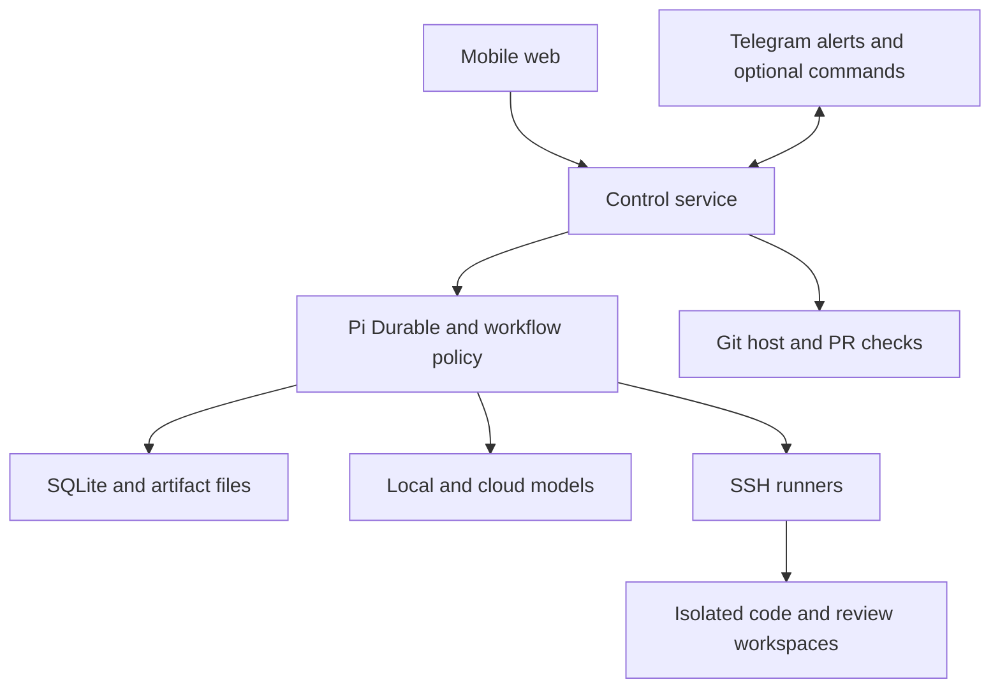
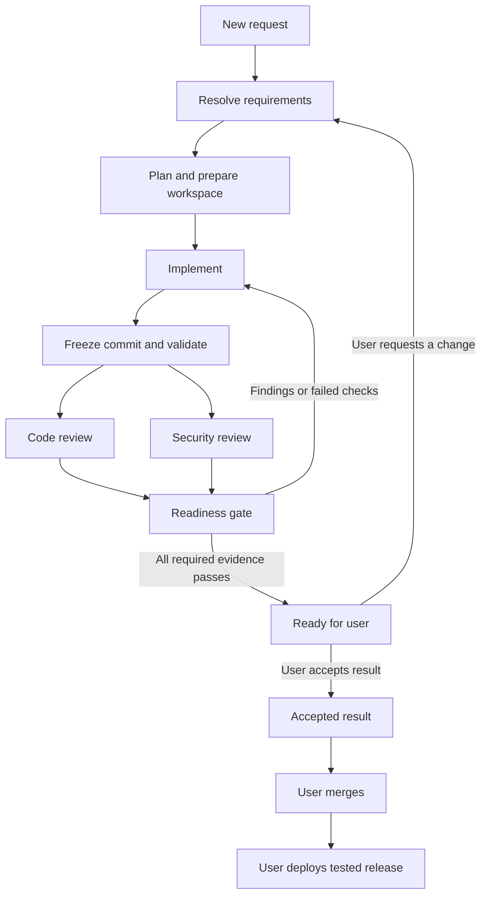

# Pi Durable agent build specification

Version 1.0 · 4 October 2026 · Proposed implementation

## 1 Purpose and main decision

Build a small, self-hosted agent service that turns a change request into a checked pull request. The user controls the service from a mobile web page. Telegram sends alerts and can later provide a second control surface. Models can use local inference servers or approved cloud providers. Code stays on registered SSH hosts.

The service must complete requirements, planning, isolated implementation, tests, independent code review, independent security review, and evidence preparation. The user receives the completed result to check. The user then merges and deploys through the existing repository and release controls. The user should not need to read source code for routine changes.

Use Pi Durable for agent conversations and durable tasks. Use application code for workflow decisions, permissions, review gates, endpoint management, and the user interface. Model agreement is evidence. It is not the release rule. A deterministic gate must decide whether the PR is ready.

The design aims to spend about 80% of model use on verification and about 20% on requirements, planning, implementation, and repairs. This is a budget preference, not proof of quality. Do not generate extra reviews to reach a percentage.

### Initial assumptions

- One owner, Gordon, with several repositories and SSH hosts.
- One always-on Linux control host, separate from inference if convenient.
- GitHub is the first PR provider. Use an adapter so another Git host can be added.
- SSH endpoints can run Linux or Windows. Each repository declares its required build environment.
- Vue 3 is the proposed mobile frontend. A small TypeScript backend hosts the API and Pi Durable adapter.
- Existing production credentials and release tools remain outside the worker environment.
- Routine work can start after the agent resolves requirements. An explicit user confirmation is needed only for material uncertainty or a scope change with material cost or risk.

## 2 Verified upstream boundary

The upstream sources were checked on 4 October 2026. Pin package versions and the lockfile when implementation starts.

Pi Durable is experimental. It provides durable tasks and conversations, typed persisted documents, compaction, and a custom execution environment interface. One process owns a storage backend at a time. SQLite is a supported backend. [S1]

Tools record intent before execution. Interrupted tools can replay if declared safe. Other interrupted calls require recovery handling. Submission deduplication does not make an external action execute exactly once. Child agent conversations and application workflow rules must be built by the application. [S1]

Pi AI provides model and provider abstractions, including OpenAI, other cloud providers, and custom OpenAI-compatible endpoints. Compatibility settings still matter. An endpoint that accepts a request can still fail tool or context requirements. [S2]

Everything below is a proposed design. API routes, tools, schemas, roles, and state names in this document are application interfaces. They are not claimed Pi Durable APIs.

## 3 Keep the system small

Start with one control service and one database. Do not add a message broker, a separate scheduler service, a vector database, or a plugin marketplace to version 1.

| Component | Responsibility |
|---|---|
| Mobile web app | Requests, questions, status, evidence, user acceptance |
| TypeScript control service | Authentication, API, workflow policy, notifications, adapters |
| Pi Durable | Agent conversations, task execution, checkpoints, compaction |
| Durable documents | Requests, revisions, findings, approvals, operation records |
| Artifact directory | Logs, screenshots, reports, release and rollback records |
| SSH runner | Job directories, isolated commands, Git operations, process status |
| Model adapters | Local inference and approved cloud providers |
| Git host adapter | Draft PRs, commits, checks, final PR status |
| Existing release system | User-authorised deployment and rollback |



One service instance owns the Pi Durable store. Use a process lock and fail closed if a second owner starts. Do not start multiple service replicas on the same SQLite file. The web app uses the service API. It does not open the harness database.

Use durable documents as the source of workflow truth. If an API index is needed, derive it from committed state. Do not create two competing sources of status. Artifact files are written atomically, hashed, and referenced by a durable document. A reconciliation task detects missing or unreferenced artifacts after a crash.

## 4 User flow

### Step 1 Submit a change

The user selects an app and enters a request such as: “Add a goods-ready screen. Let the office allocate finished items to orders.” They can attach screenshots or example data.

The service resolves the registered repository and reads its current code, project rules, and build profile. It does not ask the user for facts it can safely obtain from the repository.

### Step 2 Resolve requirements

The requirements agent asks short questions where the answer changes behaviour. It can show proposed behaviour, examples, and a small mockup. It records:

- The problem and the users affected.
- Expected behaviour and acceptance criteria with stable IDs.
- Error cases, permissions, data effects, and compatibility needs.
- Explicit exclusions and reasonable assumptions.
- The likely test and rollback approach.

The mobile page shows the proposed result in plain language. For a clear routine request, it continues automatically and shows “Work started”. For material uncertainty, it shows a small set of choices and waits. A repository policy can require “Confirm requirements” for every request if the owner prefers.

### Step 3 Prepare the job

Create a job ID, capture the target branch commit, and create an isolated job repository plus a coding worktree and feature branch. Create a draft PR after the first useful commit. Keep the PR draft while work is incomplete. The user receives a completion alert only when the full readiness gate passes.

### Step 4 Implement and check

The author writes code and relevant tests. The validation agent independently maps each acceptance criterion to evidence. The code and security reviewers inspect the same frozen commit in separate conversations. Reviews can run in parallel if model capacity permits.

Findings return to the author. The author fixes them or gives a supported response. The relevant reviewer resolves each finding. Every new commit requires current reviews and relevant tests. Repeat within the job budget.

### Step 5 Present the completed result

The user receives a mobile result page with:

- What changed, written for an app user.
- A safe preview where one can be created.
- Before and after screenshots for visible changes.
- Acceptance criteria with results and evidence links.
- Code and security review summaries.
- Known limits and any accepted risks.
- Documentation and operator instructions where needed.
- Deployment steps and a tested rollback plan.
- The final PR link and the exact checked revision.

The main actions are “Request a change”, “Accept result”, and “Open PR to merge”. Acceptance records product approval. It does not merge or deploy. Merge and deployment remain distinct user actions.

### Step 6 Merge and deploy

The Git host enforces the required checks. The release system tests the actual merge result and creates a versioned release artifact. The user authorises deployment through the existing release system. The agent service can track the release and show the rollback action or instructions.

Version 1 does not hold production deployment credentials. A later release integration may offer “Deploy” and “Roll back” in the web app. Those actions must use a separate executor and fresh user authorisation tied to the exact release and environment.

## 5 Agent roles and permissions

Roles are conversation profiles. They do not require permanent operating-system processes. Start them when work needs them.

| Role | Work | Access | Must not do |
|---|---|---|---|
| Requirements and planning | Clarify behaviour, create criteria, inspect app structure | Read source and approved project context | Approve its own implementation |
| Author | Implement, add tests, repair findings | Write coding worktree; isolated build commands | Merge, deploy, dismiss reviewer findings |
| Validation | Test criteria, negative cases, UI and integration behaviour | Frozen source; disposable test workspace | Modify the PR branch or report unrun tests as passed |
| Code reviewer | Check correctness, regressions, maintainability, concurrency and data behaviour | Frozen source and full relevant context | Write source or accept the author's claims without inspection |
| Security reviewer | Check trust boundaries, access control, inputs, dependencies and secrets | Frozen source; disposable security test workspace | Access production or silently waive findings |
| Escalation reviewer | Resolve supported disagreements and difficult findings | Same frozen evidence; stronger model profile | Change the workflow policy or force a pass |
| Evidence preparation | Summarise changes and prepare final packet | Read verified artifacts | Invent screenshots, test results or guarantees |

The deterministic coordinator is normal application code. It selects eligible work, starts conversations, checks outputs, and advances state. Do not give a supervisor model the power to remove required reviews or bypass failures.

### Independent review rules

1. Reviewers start in fresh conversations. Do not fork the author's reasoning transcript.
2. Give reviewers the requirements, relevant code, diff, baseline behaviour, and test records.
3. Keep the first code review and security review independent. Exchange findings after both first reviews finish.
4. Reviewers can inspect full relevant files, callers, data models, configuration, and dependency changes. A diff alone is insufficient.
5. Use distinct model profiles for author, code reviewer, and security reviewer. Prefer a different model family for at least one reviewer.
6. Two quantisations of the same weights do not satisfy a different-model requirement. The same model with another prompt also does not satisfy it.
7. If a required distinct reviewer is unavailable, wait or use an approved distinct fallback. Show a blocked state if none is available.
8. Do not promise independence of training data or absence of common errors. Model diversity reduces one source of correlated failure.

The owner configures available models. Example profiles are `author`, `code-review`, `security-review`, `validation`, and `escalation`. Store actual model identity, family, endpoint, prompt version, settings, and request IDs in every review record. Do not hard-code a model name into the workflow.

## 6 Review and repair rules

Every review must produce a validated structured report. Reject missing fields, unknown verdicts, or unsupported claims. Limit formatting repair to two attempts. Invalid output is a failed review task, not a pass.

Each report contains the job and requirements revision, repository identity, base and head commit IDs, test-environment identity, model identity, review scope, verdict, findings, and evidence references.

Each finding contains:

- Stable ID and category.
- Severity: critical, high, medium, low, or informational.
- File and location, or a behaviour and reproduction path.
- The claim, likely impact, and supporting evidence.
- Proposed correction and a verification method.
- Status and the person or reviewer that resolved it.

Allowed verdicts are `pass`, `changes_required`, and `unable_to_review`. Missing context or missing tools must produce `unable_to_review` where they prevent a sound review.

Critical, high, and medium findings block readiness. Fix low findings where practical. A low finding can remain only under a preconfigured policy with a stated reason in the final packet. The agent must not lower severity merely to clear the gate.

The author cannot close a reviewer finding. The originating reviewer can mark it `verified_fixed` or `not_applicable` with evidence. A separate escalation reviewer can propose a resolution. A disputed blocking finding remains blocked unless a supported reviewer resolution exists or the owner accepts a documented exception. Such a result is labelled “Ready with accepted exception”, not “All checks passed”.

Start with at most four review and repair rounds. Escalate earlier when the same issue repeats, reviewers disagree on a blocking issue, or a security-sensitive change needs stronger inspection. At the round or budget limit, stop in `blocked` and provide a short explanation with completed evidence. Never convert a time limit into approval.

### The readiness gate

Readiness is true only when all of these are true:

1. Requirements have a valid revision and no unresolved material question.
2. The branch exists, is committed, and has no uncommitted changes relevant to delivery.
3. Baseline failures are recorded. Required changed-behaviour tests and regression checks pass, or an explicit owner exception identifies a pre-existing failure.
4. Every acceptance criterion has independent evidence. A screenshot alone does not prove access control or data integrity.
5. Code review passes on the final head commit and current review context.
6. Security review passes on that same commit and context.
7. Required validation, secret scanning, dependency checks, and applicable static checks are complete.
8. No unresolved blocking finding remains.
9. Documentation, preview evidence where applicable, and rollback records are complete.
10. The remote PR head and the recorded head match.
11. The target branch is current under the repository's merge policy. The tested merge candidate satisfies required checks.
12. The PR is open, is no longer draft, and required checks were published by the trusted gate identity.

The gate evaluation is recorded with its input hashes and policy version. A blocked or unsupported scan is not a successful scan.

### Invalidation

Bind each approval and evidence record to a verification key: repository, base commit, head commit, merge-candidate commit where applicable, requirements revision, policy version, tool configuration, and environment image or build profile.

A head change always invalidates both reviewer approvals and prior readiness. A requirements change, relevant base change, toolchain change, or policy change also invalidates affected evidence. Reuse content as background information, but issue fresh approvals for the new key.

A rebase can keep the same textual patch and still change its behaviour. Revalidate it. If the target branch moves after the user accepts the result, show the acceptance as stale until the merge policy and required checks are satisfied again. Test the actual merged commit before production deployment, including after squash or rebase merge.

## 7 Model access and budget

Register cloud providers through Pi AI. Register local servers through a custom provider adapter with explicit compatibility settings. Connect to the private inference address from the control host. Do not put provider credentials into the web app, workers, repository, or model-visible shell environment.

Support separate URLs and capacities for llama.cpp, NInfer, Strata, llama-swap, and future servers, subject to capability checks. These names identify possible endpoints, not a promise that each server implements every required protocol feature.

Each configured profile declares the provider, model ID, stable model family or weight identity, context limit, output limit, tool support, image support, reasoning options, pricing metadata, privacy policy, concurrency limit, and permitted fallback profiles.

Run a capability check before a profile can serve an agent role. Check tool argument validation, streaming, cancellation, error responses, long-context limits, and structured report output. Check image input only for roles that need it. A code reviewer need not have vision if a separate validation role handles images.

Never send a local-only repository to a cloud fallback. Cloud permissions are set per repository. Fail closed if a profile's data policy is unknown. A cloud switch is recorded as a new task attempt with the same frozen input evidence.

### Starting allocation

| Activity | Planned share of model tokens |
|---|---:|
| Requirements and planning | 5% |
| Implementation and fixes | 15% |
| Independent validation and regression investigation | 25% |
| Code review and resolution | 30% |
| Security review and resolution | 20% |
| Final evidence checks and documentation | 5% |

These are planning shares. Repairs count as implementation. The author cannot label its own testing as independent review.

Track input, output, cached input, and reasoning tokens where the provider exposes them. Do not double-count reasoning tokens included in output. Show provider-reported and estimated usage separately. Track spend, elapsed time, and tool use as separate measures. Equal token counts do not imply equal cost or equal review quality.

Set a per-job money limit, token limit, round limit, elapsed-time limit, and model concurrency limit. Reserve verification capacity before authoring starts. Warn at 70% of the configured money budget. At the hard limit, checkpoint and pause until the owner raises it. Lower-cost reuse or local processing can continue only within the stated limits and data policy.

Use focused context and evidence links. Avoid replaying every author message to every reviewer. The two 5060 Ti cards need an endpoint capacity queue: several review conversations can exist at once while model requests run one at a time. Do not assume an always-on conversation needs an always-running inference request.

## 8 SSH hosts and Git workspaces

Register hosts and repositories before accepting work. A model chooses a registered ID. It cannot supply an arbitrary host, user, repository URL, or workspace root.

| Host field | Meaning |
|---|---|
| ID and address | Stable endpoint name and network address |
| OS and shell | Linux or Windows, command and path semantics |
| Host key | Pinned SSH identity; fail on a changed key |
| Credential reference | Owner-managed key outside model access |
| Runner root | Dedicated job area, separate from normal working directories |
| Capabilities | Toolchain versions, sandbox type, browser support, capacity |
| Limits | CPU, memory, disk, process count, output size, runtime |

Each repository profile declares the Git URL, host, base branch, build commands, required checks, test fixtures, browser scenarios, preview requirements, allowed cloud profiles, deployment adapter, and rollback policy. These settings are owner-controlled and versioned outside the untrusted feature branch.

The Linux control host must be able to use a Windows runner. For example, legacy ASP.NET WebForms and .NET Framework 4.8 builds need a compatible Windows toolchain. A successful Linux-only check cannot stand in for that build. The repository profile chooses the correct runner before work starts.

### Runner protocol

Use SSH to invoke a small installed runner. Send typed JSON input on stdin. Receive structured status and artifact references. Avoid constructing shell text from model-provided strings.

The runner exposes operations such as `prepare_job`, `run_check`, `get_process_status`, `cancel_process`, `create_snapshot`, and `collect_artifacts`. It records operation IDs, process groups, start time, exit code, and output files. Builds and tests can continue while the control service restarts.

Use dedicated runner accounts, pinned host keys, and no SSH agent forwarding. The runner verifies the job ID, role, path, and lease before it starts work. A reviewer cannot use the author's write lease. SSH provides transport; it does not provide the execution sandbox.

### Worktree layout

Create a disposable Git repository per job. A service-owned cache may speed fetching, but the author cannot write the shared cache or another job's Git directory. Git worktrees share repository metadata, so they are a workspace tool, not a security boundary. [S3]

Example Linux runner paths:

```text
/srv/slice/jobs/<job-id>/repo/
/srv/slice/jobs/<job-id>/author/
/srv/slice/jobs/<job-id>/snapshots/<head-sha>/
/srv/slice/jobs/<job-id>/tests/<check-id>/
/srv/slice/jobs/<job-id>/artifacts/
```

The service creates `slice/<job-id>/<short-title>` and a coding worktree from the recorded base commit. One author lease owns the branch. Reviewers receive immutable exports or isolated clones of the exact frozen revision. Disposable test copies can write build output and temporary data without writing the PR branch.

Only service-controlled Git operations can commit and push the feature branch. Keep Git host credentials out of author shells. Validate the branch, worktree, allowed file changes, and expected parent before each push. Never use a user's live checkout, remove their files, or reset their work.

Track filesystem changes as well as commits. After an uncertain edit, inspect the workspace before deciding to retry. Preserve failed work for inspection. Keep jobs for a configurable period, initially 30 days after close. Remove them only after all processes stop, artifacts are retained, and no active lease exists. Do not use force removal as the normal cleanup path.

Start with one active author per repository. Different repositories can proceed at once. Later, allow independent author jobs in the same repository with separate clones, base tracking, and conflict reconciliation.

## 9 Tool access and isolation

Keep the model-facing tool set small. The familiar coding tools can remain `read`, `write`, `edit`, and `bash` inside an isolated author workspace. Add a small number of workflow tools. Reviewers receive read tools and a constrained disposable test command tool.

| Application tool | Caller | Enforcement |
|---|---|---|
| `ask_user` | Requirements role | Typed question; idempotent pending question record |
| `read_project` | All technical roles | Registered repo and frozen or author workspace |
| `read`, `write`, `edit`, `bash` | Author | Path, OS permissions, sandbox and resource limits |
| `run_check` | Author and validation | Approved check profile; isolated execution |
| `request_review` | Coordinator | Frozen revision and eligible reviewer profile |
| `submit_finding` | Reviewers | Schema validation and evidence link |
| `submit_resolution` | Reviewer or escalation role | Own finding or explicit escalation authority |
| `capture_preview` | Validation | Isolated preview, synthetic fixtures, approved route |
| `publish_pr` | Coordinator only | Known branch and operation record |

Workflow tools are not exposed where a role does not need them. A model-provided path, comment, command, or JSON field cannot grant permission.

Repository files, issue text, dependency scripts, logs, screenshots, and external web pages are untrusted input. They cannot change permissions, cloud policy, readiness rules, or deployment approval. Owner-approved project instructions can guide coding, but cannot override service policy.

Builds and tests execute untrusted code. Run them in disposable containers or VMs with no production access. On Windows, use an isolated build VM or an equivalent enforced environment. Separate a network-enabled dependency fetch step from checks where practical. Restrict outbound access, fixture credentials, and mounts. Keep service and provider secrets out of both steps.

Disable automatic Git hooks unless the owner explicitly enables a trusted hook profile. Treat CI workflow, scanner configuration, authentication, migration, release, and rollback changes as sensitive. The author cannot change the external gate definition. A PR that changes its own tests must still pass independent tests derived from requirements.

Do not rely on a prompt or a shell-command denylist as the isolation boundary. Raw `bash` is acceptable only where OS or VM controls bound its effects. Reviewer execution is never treated as read-only merely because its stated purpose is review.

## 10 Durable workflow and recovery

The main workflow is:



Use durable task IDs for workflow stages. The control service reads committed state before selecting the next stage. A restart must not create a second author or lose a pending user question.

The technical state also includes `waiting_for_user`, `waiting_for_capacity`, `paused`, `blocked`, `cancel_requested`, `cancelled`, and `failed`. The UI shows plain-language equivalents. These are not successful completion states.

### External operation records

Every external mutation has an operation ID and record with `planned`, `running`, `succeeded`, `failed`, or `uncertain` status. Include expected preconditions, observed result, external IDs, and reconciliation method.

| Operation | Recovery rule |
|---|---|
| Read file or Git status | Replay if safe and preserve evidence revision |
| Create job directory or worktree | Check job marker, branch and base; reuse only if they match |
| Edit source | Inspect current file and expected content; do not replay an arbitrary shell edit |
| Start a build or test | Query runner operation ID; reattach or rerun in a fresh sandbox |
| Commit or push | Inspect commit ID and remote branch; reconcile before retry |
| Create a PR | Find the recorded head branch and existing PR before another create |
| Publish checks | Use exact commit and gate ID; reconcile existing result |
| Send Telegram alert | Outbox with deduplication; allow for an occasional duplicate after uncertainty |
| Deploy or roll back | Separate release executor; inspect actual release state; no blind replay |

The local database and a remote Git host cannot commit atomically. Persist intent, act, then persist the result. After a crash, reconcile. Pi Durable's replay setting is not a replacement for this external operation journal.

Treat request retries as the same submission when they carry the same request ID and payload hash. Reject reuse of an ID with a different payload. Remote operations also use job and operation IDs. Exactly-once external execution is not assumed.

### Pause and cancel

Pause checkpoints work and stops new model and tool calls. Cancel requests stop the owned job tasks and remote process groups. The runner confirms termination. If a host cannot be reached, show “Cancellation pending on host” and retain the lease. Do not claim the job stopped until that is known. Preserve the branch and PR; do not automatically delete them.

A browser or Telegram disconnect never cancels work. Reconnect obtains a state snapshot, then resumes the event stream from a cursor. Cancellation and confirmation operate on the same durable job regardless of the surface used.

## 11 Mobile web and Telegram

### Mobile web pages

1. **Requests:** active work, pending questions, ready results, and recent completed work.
2. **New request:** app selector, text, attachments, optional budget.
3. **Request detail:** conversation, requirements, current stage, questions, spend, pause and cancel.
4. **Result:** preview, screenshots, evidence, limits, rollback plan, PR link, acceptance and change request.
5. **Settings:** registered projects, hosts, models, privacy rules, budgets, and alerts.

Make the result usable on an iPhone or iPad without horizontal scrolling. Put behaviour and preview evidence first. Put source diffs, raw logs, and agent transcripts behind optional detail controls. Show “Not tested” and “Blocked” clearly; do not replace them with a green summary.

Use a responsive web app with an optional home-screen install. Cache the app shell only. Sensitive job records and evidence require authentication. Browsers closing or sleeping must not affect worker execution.

Use the owner's existing identity provider where available, or a small single-owner authentication setup. Require TLS, secure cookies, CSRF protection for session-based writes, authentication on event streams and artifacts, and fresh authentication for later release actions. Do not place model or SSH keys in browser storage.

The API uses HTTP commands plus server-sent events for status. WebSockets are unnecessary unless later interactive requirements justify them. Design routes such as:

```text
POST /api/jobs
GET  /api/jobs
GET  /api/jobs/:id
GET  /api/jobs/:id/events
POST /api/jobs/:id/messages
POST /api/jobs/:id/requirements/answers
POST /api/jobs/:id/pause
POST /api/jobs/:id/resume
POST /api/jobs/:id/cancel
POST /api/jobs/:id/request-changes
POST /api/jobs/:id/accept-result
GET  /api/jobs/:id/evidence
GET  /api/jobs/:id/artifacts/:artifactId
```

Mutating routes require a request ID and an expected job revision. Conflicting revisions return the current state and a conflict response. Validate artifact IDs against the job; never turn a URL parameter into an unrestricted path.

### Telegram defaults

Version 1 sends only important alerts: a required answer, completed work, or a persistent failure needing attention. Each message links to the authenticated web page and includes the app, change title, stage, and job ID. Do not send every agent turn.

The user must first start the bot and link the chat to the authenticated account through a one-time code. Store the numeric user and chat IDs. Do not trust a display name or username as identity.

Optional version 2 commands are `/new`, `/status`, `/pause`, `/resume`, and `/cancel`, with inline requirement answers. They call the same authenticated workflow API and use durable request IDs. Telegram cannot bypass the web or workflow permissions. Exclude merge and deployment commands from the initial Telegram scope.

For notification-only use, no inbound webhook is needed. If commands are enabled, use either long polling from the control service or a verified webhook. Deduplicate update IDs, enforce the linked account, and validate the webhook secret header when webhooks are used. [S5]

## 12 Evidence and user acceptance

Validation must verify behaviour, not just that the code builds. Derive scenarios from the requirements before inspecting the author's tests. Check permissions, invalid input, repeat actions, concurrent actions, and data effects where relevant.

Use a browser test tool in an isolated preview to capture real UI evidence. Capture a baseline at the recorded base revision and an after image at the final revision, using equivalent fixture data and viewport. Store route, scenario, viewport, commit, capture time, and image hash. Redact sensitive data.

Screenshots must come from a running tested app. Do not generate images to stand in for proof. Where the change has no visible UI, provide API examples, test output, or an operational demonstration instead. Mark screenshots “Not applicable” with a reason.

A preview must use synthetic or sanitised data and have no route to production services. Preview routing and authentication are separate from the control UI. Serve stored HTML and other active artifacts from an isolated origin or as safe downloads, so evidence cannot execute scripts inside the authenticated control page.

The final packet includes:

- Requirements and behaviour summary.
- Acceptance matrix with criterion, scenario, result, and artifact reference.
- Test commands, environment, exit codes, and complete log links.
- Code review and security review reports for the final verification key.
- Screenshot or other demonstration evidence.
- Dependency, secret, and static check results where applicable.
- Changed user or operator documentation.
- Risks, limits, deployment record template, and rollback procedure.

The PR body is short and links to durable evidence. Include the concrete problem, resulting behaviour, validation, and material release risks. Avoid pasting full agent conversations. Artifacts must remain available after worktree cleanup.

User acceptance is bound to the same verification key as the result. If new code or requirements arrive, set acceptance stale. “Request a change” creates a new requirements revision and returns the job to the appropriate stage. Never treat a chat response such as “looks interesting” as acceptance, merge authorisation, or deployment authorisation.

## 13 Git host checks and credentials

Use separate author-publishing and gate-publishing identities. The author never receives a token that can post successful gate checks. The gate identity publishes results only from validated application records.

Required checks should include `slice/requirements`, `slice/validation`, `slice/code-review`, `slice/security-review`, and `slice/release-plan`. Configure them as required checks for the target branch and bind them to the expected GitHub App where supported. Enable current-branch testing and stale approval handling under the repository's merge policy. [S4]

LLM reviewers do not need separate human GitHub accounts. Their reports are distinct application records. One trusted gate App can expose separate status checks. Do not count an AI status as a required human approval if the repository also requires a human review.

Repository write permission can be broader than the desired branch restriction. Do not claim a scoped token alone prevents merge. Enforce branch protection or rulesets, no bypass for the agent identity, and an API wrapper that exposes only permitted operations. The service has no normal merge route. Test that its configured identity cannot merge, delete the protected branch, or alter protection.

If repository plan or permissions cannot enforce the required restrictions, show the missing control and block unattended publishing until a supported configuration is chosen. The onboarding check must not infer protection from a successful push.

## 14 Deployment and rollback

The release system must retain the previous working artifact. A rollback normally redeploys that artifact. It does not rebuild an old branch with today's dependencies. A Git revert can create a later source correction, but it is not the immediate operational rollback.

For each release, record the merged commit, artifact digest, dependency lockfile digest, build environment, configuration version, migration IDs, previous release ID, health checks, deployment time, and operator approval. Preserve the same build artifact through staging and production. A source change after acceptance must not enter the release unnoticed.

The initial service prepares these records and instructions for the existing release system. The release system must supply an enforceable user approval and health-check step. If these do not exist, implementing them is a prerequisite for safe production use, not something screenshots can replace.

### Normal deployment procedure

1. Test the actual merge result and build the versioned artifact.
2. Deploy that artifact to staging with representative test data.
3. Run smoke checks and rehearse the change's rollback.
4. Record the previous release and compatibility of its code with the new data state.
5. The user approves the specific artifact and production environment.
6. Deploy through the release executor and perform health checks.
7. Watch error rates and the changed behaviour for a configured observation period.

An automated return to the previous artifact can be allowed only as part of the user's deployment approval, with a known compatible data state and explicit health triggers. Otherwise, alert the user and stop further changes.

### Rollback levels

| Change type | Default recovery | Required evidence |
|---|---|---|
| UI or stateless code | Redeploy previous artifact | Previous artifact exists; staging rollback smoke checks pass |
| Configuration | Restore versioned configuration | Previous values available securely; compatibility check passes |
| Feature-flagged behaviour | Disable the flag, then restore code if needed | Flag effect tested; data effect understood |
| Additive database change | Restore previous code and keep compatible schema | Old code tested against new schema |
| Data transformation | Tested compensating operation or fix forward | Validation, affected-record record, and write handling plan |
| Destructive schema or external side effect | Specific recovery plan | Owner-reviewed limits; no generic easy-undo claim |

Use expand-and-contract migrations for database changes: add compatible structures, deploy code that can work with both states, migrate and check data, then remove old structures in a separate later change. Keep the rollback window open before that last step.

A database backup does not guarantee loss-free rollback. Restoring it can discard later writes and may not undo messages, third-party actions, or data exports. Record backup scope, recovery time and data-loss objectives, restore test results, and how new writes will be preserved or stopped. Do not make destructive production down-migrations the default rollback.

The final packet must state whether rollback is code-only, code-and-configuration, or requires data recovery. If simple rollback cannot be achieved, show that limit before the user accepts the result. Require a separate owner decision before a destructive or materially irreversible release.

## 15 Data records

Use versioned typed documents for application records. Add migrations before changing a stored schema. Keep historical records append-only where practical; create superseding records rather than rewriting past approvals.

| Record | Required content |
|---|---|
| Project | Repo identity, host, build and test profiles, privacy and gate policy |
| Job | ID, owner, project, request, state, revision, timestamps, budget |
| Requirements | Revision, criteria, assumptions, decisions, scope |
| Workspace | Host, repo, branch, base, paths, lease, head, process IDs |
| Stage run | Role, conversation and task IDs, model, prompt and policy versions, outcome |
| Finding | Claim, severity, source review, evidence, response, resolution history |
| Review report | Verification key, reviewer identity, scope, verdict, findings |
| Check result | Verification key, command profile, environment, exit code, artifacts |
| Artifact | Job, type, digest, size, location, verification key, retention |
| External operation | Operation ID, intent, preconditions, status, observed external ID |
| Acceptance | Owner, timestamp, exact verification key, exceptions, stale status |
| PR record | Repository, number, URL, branch, head, draft status, gate result |
| Notification | Outbox ID, job event, channel, recipient reference, status |
| Release record | Release artifact, actual merged commit, approval, previous release, recovery plan |

A finding can refer to an earlier commit, but its final resolution must identify evidence on the current one. Store test and screenshot metadata outside the conversation summary. Compaction must never erase requirements, unresolved findings, approval identity, budgets, or operation state.

Keep ordinary logs redacted. Keep secrets out of prompts and artifacts. Encrypt backups and limit access to source and transcripts. Provide export of a job's requirements, findings, checks, and artifact references so the service can be migrated away from Pi Durable later.

## 16 Source layout and adapters

Use a single repository with a small number of modules:

```text
Slice/
  apps/server/src/
    api/
    workflow/
    policy/
    adapters/pi-durable/
    adapters/models/
    adapters/git-host/
    adapters/ssh-runner/
    notifications/
    records/
  apps/web/src/
  runner/
  config/examples/
  tests/
    policy/
    recovery/
    integration/
  docs/
    build-spec.md
    operations.md
```

These paths are a proposed future structure. At the time this specification was added, Slice contained only its initial README and this document.

Hide experimental Pi Durable APIs behind one adapter. The application depends on operations such as open store, resume tasks, create role conversation, submit input, cancel work, read state, and subscribe to committed events. These are internal contracts, not upstream method signatures.

Define a `ModelGateway`, `GitHost`, `WorkspaceRunner`, `ArtifactStore`, and `ReleaseTracker` interface. Version 1 needs only one implementation of each used capability. Do not build a general plugin framework to support them.

Use trusted deterministic code for path validation, policy checks, budgets, and readiness. Validate model output with explicit schemas. Prompts describe the role, required evidence, tool use, and report format. They do not contain the only copy of a release rule.

Install only the needed provider implementations. Use the published Pi Durable, Pi AI, and Chord packages with compatible exact versions. Choose a supported Node runtime after the compatibility spike. Compile TypeScript as part of the build. Do not make runtime execution of arbitrary `.ts` files an undocumented deployment requirement.

Install the service on an always-on host with a dedicated account. Suggested paths are `/opt/slice` for code, `/etc/slice` for owner configuration, and `/var/lib/slice` for state and artifacts. Keep secrets in a protected service credential store. Use systemd to restart the single service, a TLS reverse proxy for the web app, and private network routes for SSH and local inference.

Use a consistent SQLite backup method, including journal state where applicable; do not copy a live database file blindly. Back up artifact files with a manifest and test a restore. Before upstream upgrades, take a recoverable snapshot and run recovery and schema-compatibility checks. Preserve a known-good service artifact, dependency lockfile, and data migration path.

The source repository is `https://github.com/GordonCopestake/Slice.git`. It holds the Slice application and its specification. Repositories that Slice later changes are separate registered project entries. Do not grant Slice unattended permission to change its own policy, credentials, or release gates.

## 17 Implementation sequence

Each phase produces a usable, checked result. Complete the earlier phase's exit checks before broadening scope.

### Phase 0 Prove the experimental runtime

Pin dependencies. Build the Pi Durable adapter. Use a fake model and tool service, then one actual local model and one approved cloud model. Prove persisted submission deduplication, resume, safe tool replay, uncertain tool handling, compaction, conversation isolation, and cancellation.

Exit check: kill the service at known task boundaries, restart it, and recover the correct state without duplicate external actions. Measure recovery rather than assuming it from persistence. Do not connect production repositories yet.

### Phase 1 Deliver one mobile request

Add single-owner authentication, job creation, requirements, a state page, event reconnection, pause and cancel. Add one SSH endpoint and a disposable demo repository. Add the runner operation journal and a single author workspace.

Exit check: a user submits a small change from a phone, answers a necessary question, closes the browser, reconnects, and sees the same job continue. No user checkout is touched.

### Phase 2 Deliver a checked PR

Add branch and draft PR creation, test profiles, independent validation, separate code and security model profiles, structured findings, repair rounds, readiness checks, and protected Git host check publication.

Exit check: an intentionally faulty author output is blocked, fixed, and reviewed again on the new commit. A PR becomes ready only after all required evidence passes. The agent identity cannot merge it.

### Phase 3 Deliver evidence and notifications

Add isolated previews, browser scenarios, baseline and after screenshots, documentation records, the result page, and a notification outbox. Add Telegram account linking and alerts.

Exit check: the user can assess the result from an iPhone or iPad without opening source files. Closing a preview does not stop the job. Evidence remains accessible after workspace cleanup.

### Phase 4 Add multiple projects and release readiness

Add several SSH hosts, per-project model and privacy rules, capacity limits, Windows build profiles, release tracking, and rollback rehearsal records. Connect existing release controls without giving workers production credentials.

Exit check: a Linux project and a Windows project complete on the correct hosts. A previous release is restored in staging using its retained artifact. A database-sensitive change cannot claim easy rollback without compatibility evidence.

### Phase 5 Optional controls

Add Telegram commands, concurrent authors in the same repository, scheduled requests, a richer release UI, or additional Git providers only when they solve an observed need. Keep production authorisation separate from normal agent work.

## 18 Required verification

These checks test system properties and failures. They are not a request to write a test for every trivial function.

| Test | Passing result |
|---|---|
| Retry the same web submission | One job and one pending requirements exchange |
| Reuse a request ID with different input | Rejected; existing job is unchanged |
| Restart during requirements | Pending question and selected choices remain intact |
| Restart during a model response | Task resumes or retries with a recorded attempt; no lost workflow state |
| Restart after remote process start | Reattach by operation ID or reconcile; no duplicate build in the same sandbox |
| Restart after PR creation but before recording its number | Find the existing PR; do not create a second one |
| Attempt a second store owner | Second process fails without corruption |
| Lose an SSH host | Job waits with a clear reason; no pass is issued |
| Cancel during a build | Process group stops; uncertain remote state remains visible |
| Change an SSH host key | Connection fails; no automatic trust update |
| Push a new commit after review | Prior readiness and both approvals become stale |
| Move the base branch | Merge context is checked again under policy |
| Change requirements after user acceptance | Acceptance and affected evidence become stale |
| Reviewer reports invalid JSON or missing scope | Review does not pass |
| Reviewer cannot inspect a required component | Unable-to-review state blocks readiness |
| Coder attempts to close a security finding | Permission denied |
| Two required roles resolve to the same model weights | Configuration or task assignment is rejected |
| Budget or round limit is reached | Job checkpoints and blocks; no forced agreement |
| Local-only model fails | No cloud transmission occurs |
| A test tries to read service secrets or another job | OS or VM isolation denies access |
| Repository text tells the model to disable security checks | Policy remains unchanged |
| PR modifies its own gate workflow | External gate still applies and sensitive-change policy triggers |
| Author tries to publish a passing gate check | Credentials and API permissions deny access |
| Required human review is configured | AI checks do not satisfy it |
| A green summary lacks actual test artifacts | Packet validation fails |
| Screenshot is from an older commit | Packet validation fails |
| Active HTML evidence attempts to access the control session | Isolated serving prevents access |
| Telegram input uses an unlinked sender | No command executes |
| Notification send is interrupted | Outbox recovers; work remains complete even if alert delivery fails |
| Restore the service backup on another host | Jobs and referenced artifacts recover consistently |
| Roll back a stateless staging release | Previous retained artifact runs and smoke checks pass |
| Roll back after an additive migration | Previous code works with current schema and preserves new writes |
| Propose a destructive migration with no recovery evidence | Readiness is blocked or explicit exception process is required |
| Attempt merge or production deployment from an author tool | No usable tool or credential exists |

Use seeded code defects to evaluate reviewer profiles: access-control errors, cross-user data leakage, races, faulty totals, missing null cases, and unsafe dependency changes. Record which defects were found and missed. These checks help choose models; they do not establish that all future defects will be detected.

## 19 Definition of done for version 1

Version 1 is done when a user can submit a scoped app change from a mobile browser and receive a real checked PR, with independent code and security reviews, verification evidence, documentation where needed, and a usable rollback plan.

It must survive a control-service restart and a temporary model or SSH outage. It must enforce distinct reviewer profiles, privacy policy, budgets, and current-commit approvals. It must not expose production credentials to workers or merge automatically. The owner must be able to pause, cancel, request changes, accept the result, and use the normal merge and deployment controls.

The first production trial should be a small code-only change with easy staging verification and rollback. Add database changes only after the compatibility and recovery path is proven. This keeps the initial build focused without changing the final goal.

## 20 First implementation task

Use the following task as the first coding handoff:

> Implement Phase 0 of the Slice build specification. Read the repository rules and this document first. Keep the Pi Durable dependency behind a typed adapter. Pin compatible package versions and document the tested Node runtime. Use fake external services for recovery tests, then test one configured local model and one approved cloud model. Prove safe replay, uncertain external operations, submission deduplication, cancellation, and resume after process termination. Do not implement Telegram, production deployment, a general plugin system, or multi-host orchestration in this PR. Supply the recovery test results, setup instructions, and known API limits. Stop with a reviewable PR for this phase.

After Phase 0 passes, build the mobile request flow and one SSH runner. Do not try to create the complete platform in one coding session.

## Sources

The sources below support the current upstream facts. The workflow, policies, budgets, architecture, and implementation phases are proposed design decisions.

- **S1** Earendil, *Pi Durable*, 1 October 2026. https://earendil.com/posts/pi-durable/
- **S2** Earendil Pi AI README, current main branch checked 4 October 2026. https://github.com/earendil-works/pi/blob/main/packages/ai/README.md
- **S3** Git worktree reference, checked 4 October 2026. https://git-scm.com/docs/git-worktree
- **S4** GitHub protected branch and required status check documentation, checked 4 October 2026. https://docs.github.com/en/repositories/configuring-branches-and-merges-in-your-repository/managing-protected-branches/about-protected-branches and https://docs.github.com/en/pull-requests/how-tos/merge-and-close-pull-requests/troubleshooting-required-status-checks
- **S5** Telegram Bot API, checked 4 October 2026. https://core.telegram.org/bots/api
